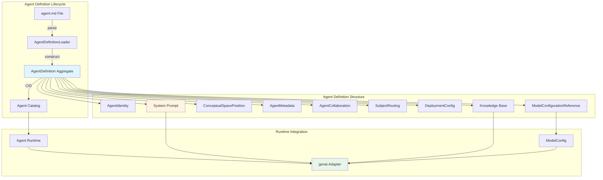
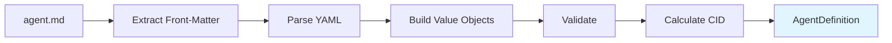
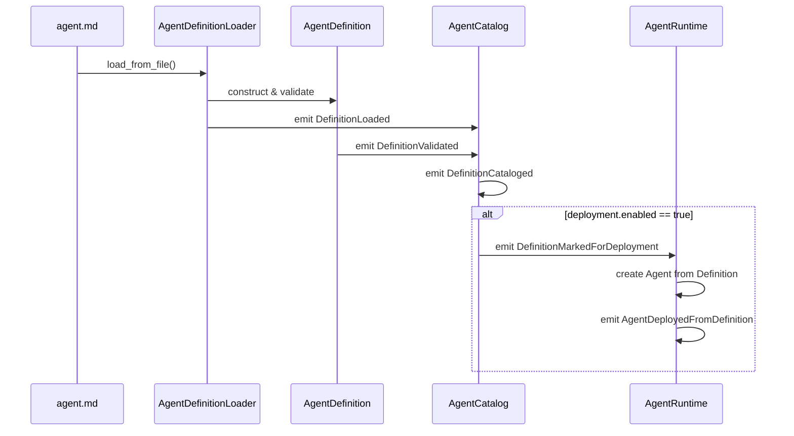
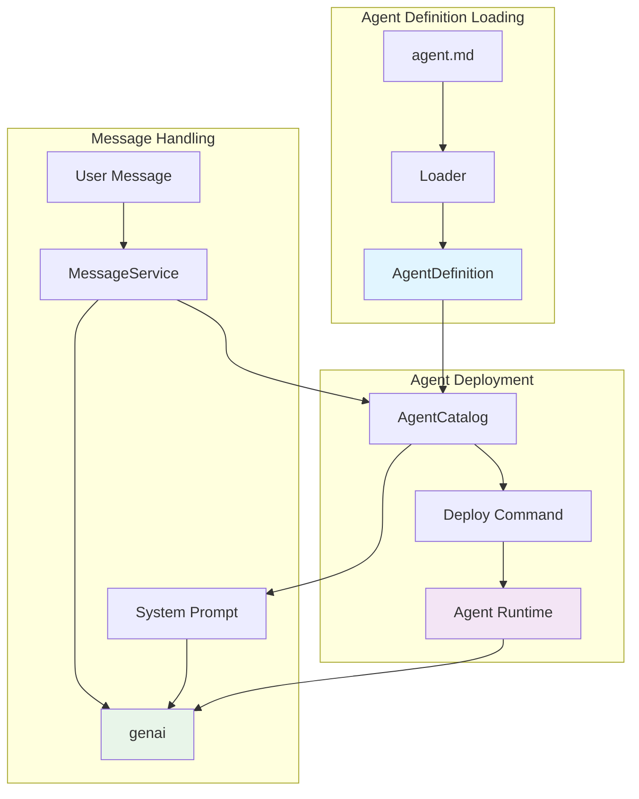

# Agent Definition Loading & genai Integration Design

<!-- Copyright (c) 2025 - Cowboy AI, Inc. -->

## Overview

This document describes the complete DDD design for loading agent configuration files (`.md` with YAML front-matter) and integrating them with genai for model inference.

## Problem Statement

**Before**: Agent `.md` files contained configuration and system prompts, but we weren't properly loading them into the domain or passing system prompts to genai.

**After**: Complete event-sourced system for:
1. Loading agent definitions from `.md` files
2. Validating and cataloging them with content-addressed identifiers (CIDs)
3. Extracting system prompts and knowledge bases
4. Integrating with genai to inject system prompts as context
5. Managing agent deployment lifecycle through events

## Architecture Overview



## 1. Unified Schema

### Schema Location
`agents/UNIFIED_SCHEMA.md` - The canonical schema merging:
- **AGENT_SCHEMA.md**: Simpler ModelConfiguration-focused schema
- **TEMPLATE.md**: Comprehensive Conceptual Spaces theory schema

### Key Design Decisions

**Q: Should we use a single unified schema?**
**A: YES** - Having two competing schemas creates confusion and maintenance burden. The unified schema:
- Supports both simple use cases (inline config) and complex use cases (referenced ModelConfiguration)
- Includes comprehensive Conceptual Spaces mapping
- Maintains backward compatibility through optional fields
- Provides clear migration path from old schemas

### Schema Structure

The YAML front-matter projects properly assembled value objects:

```yaml
---
# Identity (AgentIdentity)
id: "uuid-v7"
name: "agent-name"
display_name: "Display Name"
version: "0.1.0"

# Model Configuration (ModelConfigurationReference)
model:
  # PREFERRED: Reference existing configuration
  configuration_id: "uuid-v7"

  # OR: Inline configuration (DEPRECATED for production)
  provider: "ollama"
  model_name: "mistral:7b-instruct"
  temperature: 0.7
  max_tokens: 4096

# Conceptual Space (ConceptualSpacePosition)
conceptual_space:
  boundary: domain  # infrastructure | domain | quality | integration | theory
  quality_dimensions:
    - dimension: "salience"
      weight: 0.9
      description: "Concept identification"
  topology:
    centrality: 0.8
    connectivity: ["ddd-expert", "event-storming-expert"]

# Metadata (AgentMetadata)
description: "Agent purpose and role"
capabilities: ["capability 1", "capability 2"]
tags: ["tag1", "tag2"]

# Collaboration (AgentCollaboration)
dependencies:
  required:
    - agent: "prerequisite-agent"
      relationship: prerequisite
      reason: "Why needed"
  optional:
    - agent: "enhancer-agent"
      relationship: enhancer
      reason: "How it helps"

# NATS Routing (SubjectRouting)
routing:
  request: "agents.{name}.request"
  events: "agents.{name}.events"
  commands: "agents.{name}.commands"

# Deployment (DeploymentConfig)
deployment:
  enabled: true
  priority: 5
  auto_activate: true

---

# System Prompt (becomes model context)

You are {Agent Display Name}...

## Your Responsibilities

{Instructions for the model}

## Knowledge Base

{Domain-specific knowledge}

## Examples

{Concrete examples}
```

## 2. Value Objects

### Location
`src/value_objects/agent_definition.rs`

### Core Value Objects

#### AgentIdentity
```rust
pub struct AgentIdentity {
    pub id: AgentId,
    pub name: String,              // Kebab-case identifier
    pub display_name: String,      // Human-readable
    pub version: semver::Version,
}
```

**Purpose**: Core identity information that uniquely identifies an agent definition.

#### ModelConfigurationReference
```rust
pub struct ModelConfigurationReference {
    pub configuration_id: Option<ModelConfigurationId>,  // PREFERRED
    pub inline_config: Option<InlineModelConfig>,        // DEPRECATED
    pub rationale: Option<String>,
    pub alternatives: Vec<ModelAlternative>,
}
```

**Design Decision**: Support both reference-based (production) and inline (prototyping) configurations.

**Q: Why support both patterns?**
**A:**
- **Reference-based** (production): Enables configuration reuse, lifecycle management, and operational control
- **Inline** (prototyping): Enables quick experimentation without creating formal configurations
- **Deprecation path**: Mark inline as deprecated, but don't remove it

#### ConceptualSpacePosition
```rust
pub struct ConceptualSpacePosition {
    pub boundary: ConceptualBoundary,
    pub quality_dimensions: Vec<QualityDimension>,
    pub topology: ConceptualTopology,
}

pub enum ConceptualBoundary {
    Infrastructure,
    Domain,
    Quality,
    Integration,
    Theory,
}
```

**Purpose**: Maps agent to Gärdenfors Conceptual Spaces theory:
- **Boundary**: Which domain space does this agent operate in?
- **Quality Dimensions**: What measurable properties does it optimize?
- **Topology**: How is it connected to other agents geometrically?

**Q: Is this metadata or domain logic?**
**A: Domain logic** - The conceptual space position determines:
1. Which agents to collaborate with (connectivity)
2. How to measure success (quality dimensions)
3. When to engage proactively (boundary crossings)

#### DeploymentConfig
```rust
pub struct DeploymentConfig {
    pub enabled: bool,
    pub priority: u8,
    pub auto_activate: bool,
    pub target_node: Option<String>,
    pub resources: ResourceLimits,
    pub restart: RestartPolicy,
    pub logging: LoggingConfig,
}
```

**Purpose**: Controls operational deployment without modifying the agent definition itself.

## 3. AgentDefinition Aggregate

### Location
`src/aggregate/agent_definition.rs`

### Aggregate Design

**Q: Should AgentDefinition be a separate aggregate or part of Agent?**
**A: SEPARATE AGGREGATE** - Different lifecycles:

| AgentDefinition | Agent (Runtime) |
|----------------|----------------|
| Immutable after CID calculation | Mutable through events |
| Content-addressed (CID) | Entity-identified (AgentId) |
| Catalog lifecycle | Operational lifecycle |
| Loaded from files | Deployed from definitions |
| Can have many versions | One runtime instance per deployment |

```rust
pub struct AgentDefinition {
    pub cid: Option<Cid>,                            // Content-addressed ID
    pub identity: AgentIdentity,
    pub model: ModelConfigurationReference,
    pub conceptual_space: ConceptualSpacePosition,
    pub metadata: AgentMetadata,
    pub collaboration: AgentCollaboration,
    pub routing: SubjectRouting,
    pub deployment: DeploymentConfig,
    pub testing: TestConfiguration,
    pub documentation: AgentDocumentation,

    // THE CRITICAL PARTS FOR GENAI:
    pub system_prompt: String,                        // Markdown body
    pub knowledge_base: Vec<KnowledgeSection>,        // Extracted sections
    pub examples: Vec<ExampleSection>,                // Extracted examples

    pub raw_yaml: Option<String>,                     // For debugging
    pub source_path: Option<String>,                  // Where loaded from
}
```

### Key Methods

```rust
impl AgentDefinition {
    /// Get system prompt with variables substituted
    pub fn interpolated_system_prompt(&self) -> String;

    /// Get complete context including knowledge base
    pub fn full_context_prompt(&self) -> String;

    /// Calculate content-addressed identifier
    pub fn calculate_cid(&self) -> Result<Cid, String>;

    /// Check required agent dependencies
    pub fn required_agents(&self) -> Vec<&str>;
}
```

## 4. AgentDefinitionLoader Service

### Location
`src/services/agent_definition_loader.rs`

### Service Architecture



### Parsing Strategy

**Q: Should we create a separate loader service?**
**A: YES** - Follows Single Responsibility Principle:
- **AgentDefinition**: Domain aggregate with business logic
- **AgentDefinitionLoader**: Infrastructure service for parsing

### Key Methods

```rust
pub struct AgentDefinitionLoader;

impl AgentDefinitionLoader {
    /// Load from file path
    pub fn load_from_file(path: impl AsRef<Path>) -> LoaderResult<AgentDefinition>;

    /// Load from string (for testing)
    pub fn load_from_string(
        content: &str,
        source_path: Option<String>,
    ) -> LoaderResult<AgentDefinition>;
}
```

### Parsing Flow

1. **Extract Front-Matter**: Split YAML (between `---`) from markdown body
2. **Parse YAML**: Deserialize into `FrontMatterRaw` intermediate structure
3. **Build Value Objects**: Convert raw YAML into domain value objects
4. **Construct Aggregate**: Assemble `AgentDefinition` from value objects
5. **Validate**: Check all business rules
6. **Calculate CID**: Create content-addressed identifier
7. **Return**: Immutable, validated `AgentDefinition`

### Error Handling

```rust
#[derive(Debug, Error)]
pub enum LoaderError {
    #[error("IO error: {0}")]
    Io(#[from] std::io::Error),

    #[error("YAML parsing error: {0}")]
    YamlParse(#[from] serde_yaml::Error),

    #[error("Invalid front-matter: {0}")]
    InvalidFrontMatter(String),

    #[error("Missing system prompt")]
    MissingSystemPrompt,

    #[error("Validation error: {0}")]
    Validation(String),
}
```

## 5. Integration with genai

### Current State
`src/adapters/genai_adapter.rs` - Basic integration, but doesn't use system prompts.

### Enhancement Design

```rust
// CURRENT (genai_adapter.rs)
fn convert_context(context: &[ContextMessage]) -> Vec<ChatMessage> {
    context.iter().map(|msg| {
        let content = MessageContent::from_text(&msg.content);
        match msg.role {
            MessageRole::System => ChatMessage::system(content),
            MessageRole::User => ChatMessage::user(content),
            MessageRole::Assistant => ChatMessage::assistant(content),
        }
    }).collect()
}

// ENHANCED (inject system prompt from AgentDefinition)
fn convert_context_with_system_prompt(
    agent_def: &AgentDefinition,
    context: &[ContextMessage],
) -> Vec<ChatMessage> {
    let mut messages = vec![];

    // 1. INJECT SYSTEM PROMPT FIRST
    let system_prompt = agent_def.full_context_prompt();
    messages.push(ChatMessage::system(
        MessageContent::from_text(&system_prompt)
    ));

    // 2. ADD USER CONTEXT
    for msg in context {
        let content = MessageContent::from_text(&msg.content);
        let chat_msg = match msg.role {
            MessageRole::System => continue,  // Skip - we already added system
            MessageRole::User => ChatMessage::user(content),
            MessageRole::Assistant => ChatMessage::assistant(content),
        };
        messages.push(chat_msg);
    }

    messages
}
```

### Integration Pattern

```rust
// AgentMessageService enhanced to load definition
pub struct AgentMessageService {
    router: CapabilityRouter,
    definition_catalog: Arc<AgentDefinitionCatalog>,  // NEW
}

impl AgentMessageService {
    pub async fn send(
        &self,
        agent: &Agent,
        intent: MessageIntent,
    ) -> Result<ChatStream, ServiceError> {
        // 1. Load agent definition by agent ID
        let agent_def = self.definition_catalog
            .get_by_agent_id(agent.id())
            .await?
            .ok_or(ServiceError::DefinitionNotFound)?;

        // 2. Get model config (resolve reference if needed)
        let model_config = if let Some(config_id) = agent_def.model_configuration_id() {
            self.load_model_config(config_id).await?
        } else {
            // Fallback to inline config
            self.build_model_config_from_inline(&agent_def)?
        };

        // 3. Build context with system prompt injection
        let context = self.build_context_with_system_prompt(&agent_def, &intent);

        // 4. Route to provider with complete context
        let provider = self.router.find_provider(&intent.capabilities())?;
        provider.send(&model_config, context).await
    }

    fn build_context_with_system_prompt(
        &self,
        agent_def: &AgentDefinition,
        intent: &MessageIntent,
    ) -> Vec<ContextMessage> {
        let mut context = vec![];

        // System prompt from definition (with knowledge base)
        context.push(ContextMessage::system(
            agent_def.full_context_prompt()
        ));

        // User context from intent
        context.extend(intent.context().clone());

        context
    }
}
```

## 6. Event Sourcing Implications

### Q: Should we fire events when loading agent definitions?
**A: YES, but for catalog operations only**

### Event Design

```rust
// NEW: Agent Definition Events
pub enum AgentDefinitionEvent {
    /// Definition loaded from file
    DefinitionLoaded {
        cid: Cid,
        agent_id: AgentId,
        source_path: String,
        loaded_at: DateTime<Utc>,
    },

    /// Definition validated successfully
    DefinitionValidated {
        cid: Cid,
        agent_id: AgentId,
        validated_at: DateTime<Utc>,
    },

    /// Definition cataloged (stored in catalog)
    DefinitionCataloged {
        cid: Cid,
        agent_id: AgentId,
        catalog_id: CatalogId,
        cataloged_at: DateTime<Utc>,
    },

    /// Definition marked for deployment
    DefinitionMarkedForDeployment {
        cid: Cid,
        agent_id: AgentId,
        priority: u8,
        marked_at: DateTime<Utc>,
    },

    /// Agent runtime deployed from definition
    AgentDeployedFromDefinition {
        agent_id: AgentId,
        definition_cid: Cid,
        person_id: PersonId,
        deployed_at: DateTime<Utc>,
    },
}
```

### Event Flow



### Separation of Concerns

| Aggregate | Responsibility | Events |
|-----------|---------------|--------|
| AgentDefinition | Immutable specification | None (content-addressed) |
| AgentCatalog | Definition registry | DefinitionLoaded, DefinitionValidated, DefinitionCataloged |
| Agent | Runtime instance | AgentDeployed, AgentActivated, AgentSuspended, etc. |

**Key Insight**: `AgentDefinition` itself doesn't fire events because it's immutable and content-addressed. Events come from:
1. **AgentCatalog**: When definitions are loaded/cataloged
2. **Agent**: When runtime instances are deployed/managed

## 7. System Prompt Versioning

### Q: Should system prompts be versioned separately from agent configurations?
**A: NO - They're versioned together via CID**

### Rationale

1. **Content Addressing**: Any change to front-matter OR system prompt produces a new CID
2. **Atomic Versioning**: Agent configuration and system prompt are inseparable
3. **Semantic Versioning**: The `version` field in identity provides human-readable versioning
4. **CID Immutability**: Once cataloged, a CID is immutable (functional approach)

### Version Evolution

```yaml
# Version 0.1.0 - CID: bafyreiabc123...
---
id: "agent-id"
name: "ddd-expert"
version: "0.1.0"
---
You are a DDD expert.

# Version 0.2.0 - CID: bafyreiabc456... (NEW CID)
---
id: "agent-id"  # SAME agent ID
name: "ddd-expert"
version: "0.2.0"  # Bumped version
---
You are a DDD expert specializing in aggregates.  # Changed prompt
```

**Key**: Same `agent-id`, different `version` and different `CID`.

### Deployment Strategy

```rust
pub struct AgentCatalog {
    /// All definitions by CID (content-addressed)
    definitions: HashMap<Cid, AgentDefinition>,

    /// Active definition per AgentId
    active_definitions: HashMap<AgentId, Cid>,
}

impl AgentCatalog {
    /// Deploy a specific version
    pub fn deploy_version(&mut self, agent_id: AgentId, cid: Cid) -> Result<()> {
        // Update active pointer
        self.active_definitions.insert(agent_id, cid);

        // Emit event
        self.emit(AgentDefinitionEvent::DefinitionMarkedForDeployment {
            cid,
            agent_id,
            priority: self.definitions[&cid].deployment.priority,
            marked_at: Utc::now(),
        });

        Ok(())
    }

    /// Get active definition for agent
    pub fn get_active(&self, agent_id: AgentId) -> Option<&AgentDefinition> {
        self.active_definitions
            .get(&agent_id)
            .and_then(|cid| self.definitions.get(cid))
    }
}
```

## 8. Validation Strategy

### Multi-Level Validation

```rust
// 1. YAML Schema Validation (structural)
let front_matter: FrontMatterRaw = serde_yaml::from_str(&yaml_str)?;

// 2. Value Object Validation (business rules)
let identity = Self::parse_identity(&front_matter)?;
identity.validate()?;

let model = Self::parse_model_config(&front_matter)?;
model.validate()?;

// 3. Aggregate Validation (cross-cutting rules)
let definition = AgentDefinition::new(...);
definition.validate()?;

// 4. Deployment Validation (operational rules)
if definition.deployment.enabled {
    validate_deployment_target(&definition.deployment)?;
    validate_resource_limits(&definition.deployment.resources)?;
}
```

### Validation Rules

#### Identity Validation
```rust
impl AgentIdentity {
    pub fn validate(&self) -> Result<(), String> {
        if self.name.is_empty() {
            return Err("Agent name cannot be empty".to_string());
        }

        // Enforce kebab-case
        if !self.name.chars().all(|c| c.is_lowercase() || c == '-' || c.is_numeric()) {
            return Err("Agent name must be kebab-case".to_string());
        }

        Ok(())
    }
}
```

#### Model Configuration Validation
```rust
impl ModelConfigurationReference {
    pub fn validate(&self) -> Result<(), String> {
        // Must have either reference OR inline config
        if self.configuration_id.is_none() && self.inline_config.is_none() {
            return Err("Must provide configuration_id or inline_config".to_string());
        }

        // Validate inline if present
        if let Some(ref inline) = self.inline_config {
            inline.validate()?;
        }

        Ok(())
    }
}
```

#### System Prompt Validation
```rust
impl AgentDefinition {
    pub fn validate(&self) -> Result<(), String> {
        // ... other validations ...

        // System prompt cannot be empty
        if self.system_prompt.trim().is_empty() {
            return Err("System prompt cannot be empty".to_string());
        }

        // Warn if system prompt is too short
        if self.system_prompt.len() < 100 {
            eprintln!("Warning: System prompt is suspiciously short ({}  chars)",
                self.system_prompt.len());
        }

        Ok(())
    }
}
```

## 9. Testing Strategy

### Unit Tests

```rust
#[cfg(test)]
mod tests {
    use super::*;

    const SAMPLE_AGENT_MD: &str = r#"---
id: "01933f3e-7b4a-7890-a1b2-c3d4e5f6a7b8"
name: "test-expert"
display_name: "Test Expert"
version: "0.1.0"
model:
  provider: "ollama"
  model_name: "mistral:7b"
conceptual_space:
  boundary: domain
---
# You are {Agent Display Name}
"#;

    #[test]
    fn test_load_from_string() {
        let result = AgentDefinitionLoader::load_from_string(SAMPLE_AGENT_MD, None);
        assert!(result.is_ok());

        let def = result.unwrap();
        assert_eq!(def.agent_name(), "test-expert");
        assert!(def.system_prompt().contains("You are"));
    }

    #[test]
    fn test_interpolated_system_prompt() {
        let def = AgentDefinitionLoader::load_from_string(SAMPLE_AGENT_MD, None).unwrap();
        let prompt = def.interpolated_system_prompt();

        // Variables should be replaced
        assert!(prompt.contains("Test Expert"));
        assert!(!prompt.contains("{Agent Display Name}"));
    }

    #[test]
    fn test_content_addressing() {
        let def = AgentDefinitionLoader::load_from_string(SAMPLE_AGENT_MD, None).unwrap();
        let cid1 = def.calculate_cid().unwrap();
        let cid2 = def.calculate_cid().unwrap();

        // Same content = same CID
        assert_eq!(cid1, cid2);
    }
}
```

### Integration Tests

```rust
#[tokio::test]
async fn test_load_and_deploy_agent() {
    // 1. Load definition from file
    let def = AgentDefinitionLoader::load_from_file("agents/test-expert.md").unwrap();

    // 2. Catalog it
    let mut catalog = AgentCatalog::new();
    catalog.add_definition(def.clone()).unwrap();

    // 3. Deploy agent from definition
    let agent_service = AgentService::new(catalog);
    let agent = agent_service.deploy_from_definition(def.agent_id()).await.unwrap();

    // 4. Send message with system prompt injection
    let message_service = AgentMessageService::new(agent_service);
    let stream = message_service.chat(&agent, "Hello!").await.unwrap();

    // 5. Verify system prompt was injected
    // (This would require inspecting the actual messages sent to genai)
}
```

## 10. Migration Plan

### Phase 1: Foundation (COMPLETE)
- [x] Create unified schema (`UNIFIED_SCHEMA.md`)
- [x] Implement value objects (`agent_definition.rs`)
- [x] Implement `AgentDefinition` aggregate
- [x] Implement `AgentDefinitionLoader` service

### Phase 2: Integration (NEXT)
- [ ] Update `genai_adapter.rs` to accept system prompts
- [ ] Create `AgentCatalog` aggregate for definition management
- [ ] Update `AgentMessageService` to load definitions and inject prompts
- [ ] Add definition events to event system

### Phase 3: Deployment (PLANNED)
- [ ] Migrate existing agent `.md` files to unified schema
- [ ] Create deployment scripts that read `deployment.enabled`
- [ ] Implement CID-based versioning in catalog
- [ ] Add NATS integration for definition events

### Phase 4: Operations (FUTURE)
- [ ] Build definition management UI
- [ ] Add hot-reload for definition changes
- [ ] Implement A/B testing for system prompt variations
- [ ] Create metrics for system prompt effectiveness

## 11. Key Takeaways

### Architectural Decisions

1. **Separate Aggregates**: `AgentDefinition` (immutable, content-addressed) vs `Agent` (mutable, event-sourced)
2. **Unified Schema**: Single canonical schema supporting both simple and complex use cases
3. **System Prompt Injection**: System prompts become first message in genai context
4. **Content Addressing**: Definitions versioned via CID, enabling immutable references
5. **Event Sourcing for Catalog**: Definition loading/cataloging fires events, not the definitions themselves

### Pure Functional Principles

- **No Mutation**: `AgentDefinition` is immutable after construction
- **Pure Functions**: All transformations return new values
- **Content Addressing**: CID provides mathematical identity
- **Algebraic Validation**: Validation as pure function composition

### Integration Points



### Next Steps

1. **Implement `AgentCatalog`**: Aggregate for managing definitions with CID indexing
2. **Enhance `genai_adapter`**: Add system prompt injection capability
3. **Update `AgentMessageService`**: Load definitions and build complete context
4. **Add Integration Tests**: Test complete flow from `.md` file to genai inference
5. **Migrate Agents**: Update existing agent files to unified schema

## References

- **DDD Patterns**: Evans' Domain-Driven Design
- **Event Sourcing**: Fowler's Event Sourcing Pattern
- **Content Addressing**: IPLD/IPFS CID specification
- **Conceptual Spaces**: Gärdenfors' Conceptual Spaces Theory
- **Pure Functional Design**: CIM Pure Functional Architecture (cim-domain v0.7.8)
