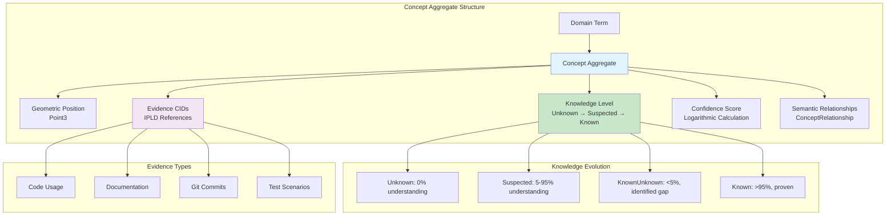
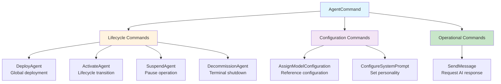
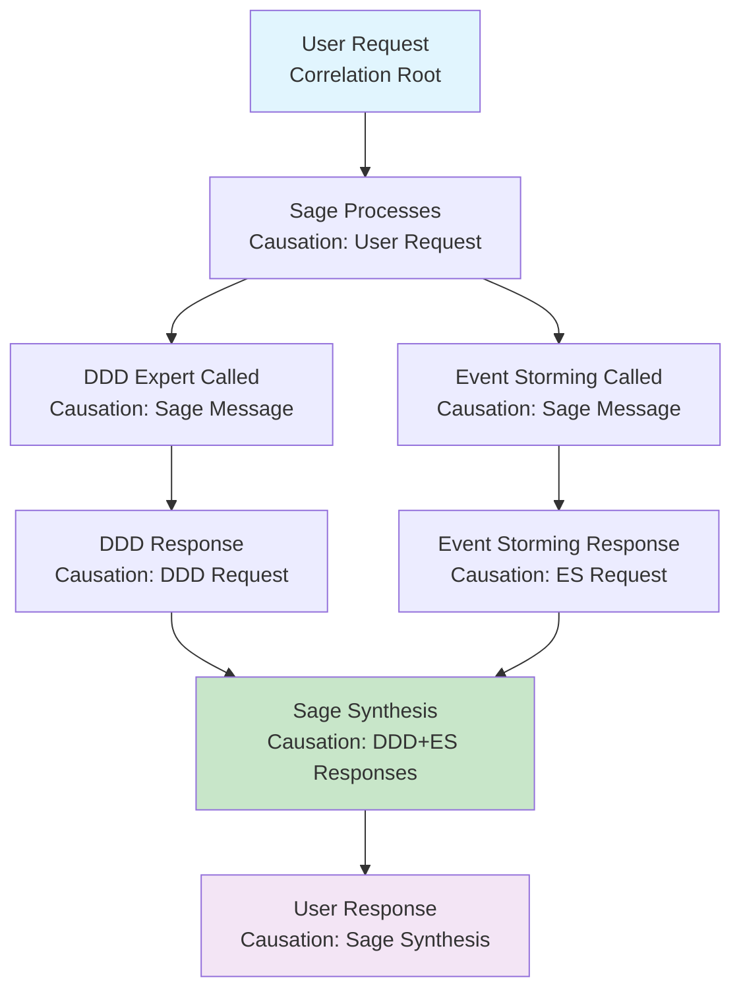
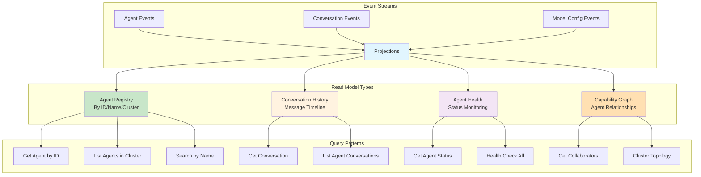
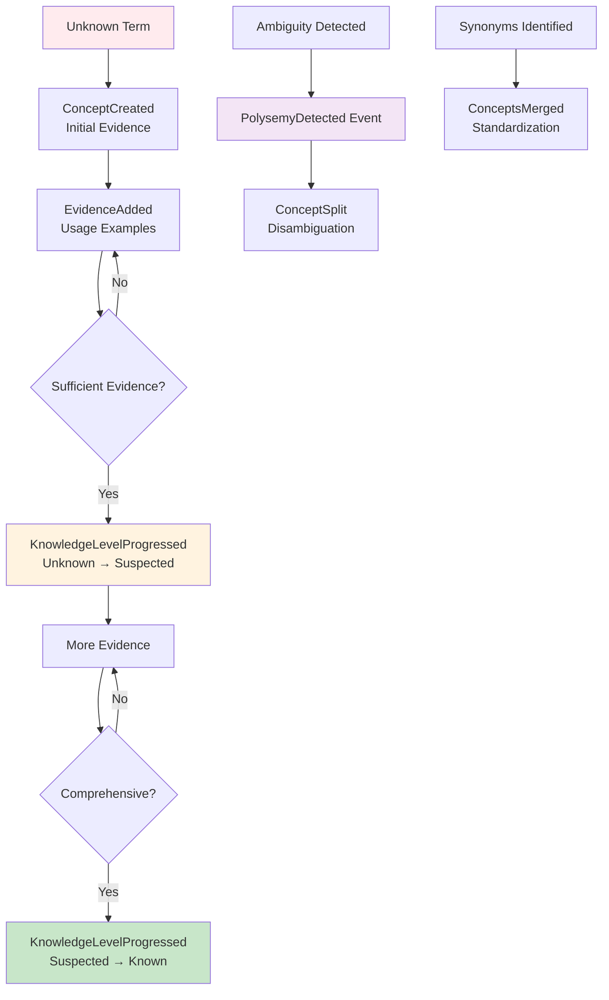

# CIM Agent Language Ontology & Taxonomies

<!-- Copyright (c) 2025 - Cowboy AI, LLC. -->

**Version**: 1.0.0
**Date**: 2026-01-23
**Domain**: cim-domain-agent (Unified Subject Architecture v1.0.0)

## Overview

This document defines the **Ubiquitous Language** for the CIM Agent System using **Concept aggregates** from cim-domain-spaces v0.8.0. All domain terms are modeled as Concepts with geometric positions in conceptual space, knowledge level evolution (Four Vital Spaces), and evidence-driven confidence scoring.

**Key Principle**: Domain terminology is NOT maintained in dictionaries or glossaries, but as **event-sourced Concept aggregates** with complete audit trails and geometric semantic relationships.

## Table of Contents

1. [Living Dictionary](#living-dictionary)
2. [Agent Taxonomy](#agent-taxonomy)
3. [Command Ontology](#command-ontology)
4. [Conversation Ontology](#conversation-ontology)
5. [Subject Semantic Structure](#subject-semantic-structure)
6. [Read Model Projection Guide](#read-model-projection-guide)
7. [Evolution Guidelines](#evolution-guidelines)

---

## Living Dictionary

### Core Concept: Terminology as Concepts

**CRITICAL**: All domain terms exist as **Concept aggregates** (cim-domain-spaces v0.8.0), NOT as strings in dictionaries.



### Primary Domain Concepts

#### 1. Agent (Aggregate Root)

**Status**: ✅ Known (Confidence: 0.98)

**Definition**: An Agent is a Person's automaton for AI model interaction. Every Agent is bound to a PersonId and has a complete lifecycle managed through event sourcing.

**Concept Properties**:
```rust
// From Concept aggregate
ConceptId: "01936f24-3c89-7f3e-8a5b-d4c8e6f2a9b1"
Name: "Agent"
Position: Point3 { x: 0.8, y: 0.6, z: 0.5 }  // Semantic space coordinates
KnowledgeLevel: Known
Confidence: 0.98  // Calculated from 47 evidence CIDs
EvidenceCids: [
    "Qm...AgentAggregate",      // agent/mod.rs definition
    "Qm...AgentTests",          // Comprehensive test suite
    "Qm...AgentEvents",         // Event definitions
    "Qm...AgentCommands",       // Command handlers
    // ... 43 more evidence references
]
```

**Semantic Relationships**:
- `parent_of` → AgentId (identifier concept)
- `requires` → PersonId (binding concept)
- `has_state` → AgentStatus (lifecycle concept)
- `emits` → AgentEvent (event concept)
- `processes` → AgentCommand (command concept)

**Lifecycle States** (separate Concept aggregates):
1. **Deployed**: Initial state after creation
2. **Active**: Operational, processing messages
3. **Suspended**: Temporarily paused
4. **Decommissioned**: Terminal state (cannot recover)

**Event Sources**:
```rust
// ConceptEvent: EvidenceAdded
Evidence CID: "Qm...AgentDefinition"
Type: "code_definition"
Content: "src/aggregate/mod.rs lines 32-305"
```

#### 2. CapabilityCluster (Value Object)

**Status**: ✅ Known (Confidence: 0.96)

**Definition**: Semantic grouping of agents based on primary capabilities. Forms conceptual spaces that organize agent references using Searle's cluster theory.

**Concept Properties**:
```rust
ConceptId: "01936f25-1d3a-7f3e-9a2b-c5d7e8f9a1c2"
Name: "CapabilityCluster"
Position: Point3 { x: 0.5, y: 0.8, z: 0.4 }
KnowledgeLevel: Known
Confidence: 0.96  // 31 evidence CIDs (10 clusters defined)
```

**Semantic Relationships**:
- `categories` → Agent (classification relationship)
- `contains` → AgentReference (membership relationship)
- `enables` → HierarchicalRouting (capability relationship)

**Cluster Enumeration** (10 Concepts):

1. **Orchestration** (1 agent)
   - Concept: `CapabilityCluster::Orchestration`
   - Members: sage
   - Purpose: Master coordination

2. **DomainModeling** (4 agents)
   - Concept: `CapabilityCluster::DomainModeling`
   - Members: ddd-expert, domain-expert, domain-ontologist-researcher, cim-domain-expert
   - Purpose: Domain-driven design and modeling

3. **EventAnalysis** (1 agent)
   - Concept: `CapabilityCluster::EventAnalysis`
   - Members: event-storming-expert
   - Purpose: Event storming and analysis

4. **Infrastructure** (3 agents)
   - Concept: `CapabilityCluster::Infrastructure`
   - Members: nats-expert, nix-expert, network-expert
   - Purpose: Infrastructure management

5. **QualityAssurance** (3 agents)
   - Concept: `CapabilityCluster::QualityAssurance`
   - Members: qa-expert, tdd-expert, bdd-expert
   - Purpose: Testing and quality

6. **FunctionalProgramming** (3 agents)
   - Concept: `CapabilityCluster::FunctionalProgramming`
   - Members: fp-expert, frp-expert, act-expert
   - Purpose: Pure functional patterns

7. **UiDesign** (4 agents)
   - Concept: `CapabilityCluster::UiDesign`
   - Members: egui-ui-expert, iced-ui-expert, cim-ui-layer-expert, cim-tea-ecs-expert
   - Purpose: User interface design

8. **Sdlc** (3 agents)
   - Concept: `CapabilityCluster::Sdlc`
   - Members: git-expert, sdlc-expert, sdlc-distributed-expert
   - Purpose: Software lifecycle

9. **ConceptualAnalysis** (5 agents)
   - Concept: `CapabilityCluster::ConceptualAnalysis`
   - Members: language-expert, graph-expert, conceptual-spaces-expert, description-expert, subject-expert
   - Purpose: Theory and analysis

10. **DomainEntities** (3 agents)
    - Concept: `CapabilityCluster::DomainEntities`
    - Members: people-expert, org-expert, location-expert
    - Purpose: Core domain entities

**Subject Patterns**:
```
agent.{capability}.{name}.{id}.command.{type}
agent.{capability}.{name}.{id}.event.{type}
```

#### 3. AgentReference (Value Object)

**Status**: ✅ Known (Confidence: 0.97)

**Definition**: Complete agent identification combining CapabilityCluster (conceptual space), Agent name (sense), and AgentId (reference). Implements Frege's sense+reference distinction.

**Concept Properties**:
```rust
ConceptId: "01936f26-2e4b-7f3e-8b3c-d6e8f9a2b3c4"
Name: "AgentReference"
Position: Point3 { x: 0.6, y: 0.7, z: 0.6 }
KnowledgeLevel: Known
Confidence: 0.97
```

**Philosophical Foundations** (Concept Relationships):
- `implements` → FregesSenseReference (Frege: sense + reference both present)
- `satisfies` → RussellsLogicalForm (Russell: existence/uniqueness via UUID)
- `preserves` → EvansCausalProvenance (Evans: ID traces to deployment event)
- `organizes_via` → SearleSClusterTheory (Searle: capability clusters)

**Header Format**:
```
{capability-cluster}.{agent-name}.{agent-id}
Example: orchestration.sage.01936f11-4ea2-7f3e-9f3a-e6c8c6d8a5f1
```

#### 4. ConversationId (Value Object)

**Status**: ✅ Known (Confidence: 0.95)

**Definition**: First-class semantic namespace for multi-turn agent interactions. All participants subscribe to conversation subjects.

**Concept Properties**:
```rust
ConceptId: "01936f27-3f5c-7f3e-9c4d-e7f9a1b2c3d5"
Name: "ConversationId"
Position: Point3 { x: 0.7, y: 0.5, z: 0.7 }
KnowledgeLevel: Known
Confidence: 0.95
```

**Semantic Relationships**:
- `groups` → AgentMessage (conversation scoping)
- `enables` → MultiTurnInteraction (capability)
- `uses` → UUIDv7 (implementation detail)

**Subject Pattern**:
```
agent.conversations.{conversation-id}.{message-type}

Types: request, response, error, status
```

#### 5. ModelConfiguration (Aggregate)

**Status**: ✅ Suspected (Confidence: 0.72)

**Definition**: Reusable AI model configuration shared across multiple agents. Manages model provider, parameters, and lifecycle.

**Concept Properties**:
```rust
ConceptId: "01936f28-4a6d-7f3e-ad5e-f8a9b1c2d3e6"
Name: "ModelConfiguration"
Position: Point3 { x: 0.4, y: 0.6, z: 0.5 }
KnowledgeLevel: Suspected  // Recently added, needs more usage evidence
Confidence: 0.72  // Less evidence than Agent
```

**Known Unknowns**:
- ⚠️ How should model configuration versioning work across agent upgrades?
- ⚠️ What are the performance implications of shared vs per-agent configs?

**Semantic Relationships**:
- `referenced_by` → Agent (many-to-one relationship)
- `has_state` → ConfigurationStatus (lifecycle)
- `configures` → ModelProvider (Ollama, OpenAI, etc.)

### Subject Algebra Concepts

#### 6. Subject (Free Monoid)

**Status**: ✅ Known (Confidence: 0.99)

**Definition**: Mathematical subject structure from cim-domain implementing free monoid properties with validated segments.

**Concept Properties**:
```rust
ConceptId: "01936f29-5b7e-7f3e-be6f-a9b1c2d3e4f7"
Name: "Subject"
Position: Point3 { x: 0.9, y: 0.8, z: 0.9 }  // High confidence, central concept
KnowledgeLevel: Known
Confidence: 0.99  // cim-domain fully tested (106 tests passing)
```

**Mathematical Properties** (Concept Relationships):
- `satisfies` → FreeMonoidLaws (identity, associativity)
- `validates` → SegmentRules (no `.`, `*`, `>`, whitespace)
- `supports` → PatternMatching (wildcards `*`, `>`)

**Operations**:
```rust
// Pure functional subject construction
let domain = Subject::parse("agent")?;
let conversations = Subject::parse("conversations")?;
let conv_id = Subject::parse(conversation_id.to_string())?;
let request = Subject::parse("request")?;

// Associative concatenation
let subject = domain
    .concat(&conversations)
    .concat(&conv_id)
    .concat(&request);
```

#### 7. SubjectPattern (Wildcard Matching)

**Status**: ✅ Known (Confidence: 0.94)

**Definition**: Pattern matching for NATS subscriptions supporting single-level (`*`) and multi-level (`>`) wildcards.

**Concept Properties**:
```rust
ConceptId: "01936f2a-6c8f-7f3e-cf7a-b1c2d3e4f5g8"
Name: "SubjectPattern"
Position: Point3 { x: 0.85, y: 0.75, z: 0.85 }
KnowledgeLevel: Known
Confidence: 0.94
```

**Wildcard Semantics**:
- `*` (single-level): Matches exactly one segment
  - `agent.*.sage.*` matches `agent.orchestration.sage.123`
- `>` (multi-level): Matches zero or more segments
  - `agent.conversations.>` matches ALL conversation messages

### Command & Event Concepts

#### 8. AgentCommand (Command Pattern)

**Status**: ✅ Suspected (Confidence: 0.78)

**Definition**: Intent to change agent state. Commands are requests that may be rejected.

**Concept Properties**:
```rust
ConceptId: "01936f2b-7d9a-7f3e-da8b-c2d3e4f5g6h9"
Name: "AgentCommand"
Position: Point3 { x: 0.5, y: 0.5, z: 0.6 }
KnowledgeLevel: Suspected  // Pattern known, all commands not yet documented
Confidence: 0.78
```

**Command Types** (Separate Concepts):
- **DeployAgent**: Create new agent (global, no agent_id required)
- **ConfigureModel**: Assign model configuration ID
- **ActivateAgent**: Transition to Active state
- **SuspendAgent**: Pause agent processing
- **DecommissionAgent**: Terminal shutdown
- **SendMessage**: Request AI model response

**Subject Pattern**:
```
agent.{capability}.{name}.{id}.command.{type}
```

#### 9. AgentEvent (Event Sourcing)

**Status**: ✅ Known (Confidence: 0.96)

**Definition**: Immutable fact describing state change. Events are the source of truth for agent state.

**Concept Properties**:
```rust
ConceptId: "01936f2c-8eab-7f3e-eb9c-d3e4f5g6h7i1"
Name: "AgentEvent"
Position: Point3 { x: 0.8, y: 0.7, z: 0.8 }
KnowledgeLevel: Known
Confidence: 0.96  // Well-tested event sourcing implementation
```

**Event Types** (Separate Concepts):

**Lifecycle Events**:
- **AgentDeployed**: Agent was created
- **ModelConfigurationAssigned**: Configuration ID assigned
- **SystemPromptConfigured**: Prompt set for agent
- **AgentActivated**: Transitioned to Active
- **AgentSuspended**: Paused
- **AgentDecommissioned**: Permanently shutdown

**Message Events** (Streaming):
- **MessageSent**: Message sent to model
- **ResponseChunkReceived**: Streaming chunk received
- **ResponseCompleted**: Full response received
- **ResponseFailed**: Error occurred

**Subject Pattern**:
```
agent.{capability}.{name}.{id}.event.{type}
```

---

## Agent Taxonomy

### Hierarchical Classification

```mermaid
graph TD
    A[Agent] --> B[Technical Agent]
    A --> C[Domain Agent]
    A --> D[Orchestration Agent]

    B --> E[Infrastructure Agent]
    B --> F[Quality Agent]
    B --> G[Theory Agent]
    B --> H[UI Agent]
    B --> I[SDLC Agent]

    C --> J[Domain Modeling Agent]
    C --> K[Domain Entity Agent]

    D --> L[Master Coordinator]

    E --> E1[NATS Expert]
    E --> E2[Nix Expert]
    E --> E3[Network Expert]

    F --> F1[QA Expert]
    F --> F2[TDD Expert]
    F --> F3[BDD Expert]

    G --> G1[FP Expert]
    G --> G2[FRP Expert]
    G --> G3[ACT Expert]
    G --> G4[Language Expert]
    G --> G5[Graph Expert]
    G --> G6[Conceptual Spaces Expert]
    G --> G7[Description Expert]
    G --> G8[Subject Expert]

    H --> H1[Egui UI Expert]
    H --> H2[Iced UI Expert]
    H --> H3[CIM UI Layer Expert]
    H --> H4[CIM TEA ECS Expert]

    I --> I1[Git Expert]
    I --> I2[SDLC Expert]
    I --> I3[SDLC Distributed Expert]

    J --> J1[DDD Expert]
    J --> J2[Domain Expert]
    J --> J3[Domain Ontologist]
    J --> J4[CIM Domain Expert]
    J --> J5[Event Storming Expert]

    K --> K1[People Expert]
    K --> K2[Org Expert]
    K --> K3[Location Expert]

    L --> L1[Sage]

    style A fill:#e1f5fe
    style B fill:#fff3e0
    style C fill:#f3e5f5
    style D fill:#c8e6c9
```



### Taxonomy as Concept Relationships

**CRITICAL**: The taxonomy is NOT a class hierarchy but a **graph of ConceptRelationship edges** between Concept aggregates.

```rust
// Agent taxonomy stored as ConceptRelationship objects
ConceptRelationship {
    relationship_id: "rel_agent_technical",
    from_concept: ConceptId("Agent"),
    to_concept: ConceptId("TechnicalAgent"),
    relationship_type: "categorized_as",
    strength: 1.0,
    evidence_cids: vec!["Qm...TaxonomyDoc"],
    created_at: Utc::now(),
}
```

### Agent Capability Mapping (by Concept)

| Agent Name | Capability Cluster | Centrality | Purpose |
|------------|-------------------|------------|---------|
| **sage** | Orchestration | 1.0 | Master coordinator for multi-agent workflows |
| **ddd-expert** | DomainModeling | 0.9 | Aggregate design, bounded contexts, ubiquitous language |
| **domain-expert** | DomainModeling | 0.8 | Domain creation, validation, event sourcing |
| **domain-ontologist-researcher** | DomainModeling | 0.7 | Industry standards, ontology alignment |
| **cim-domain-expert** | DomainModeling | 0.7 | CIM-specific domain patterns |
| **event-storming-expert** | EventAnalysis | 0.8 | Collaborative discovery, event identification |
| **nats-expert** | Infrastructure | 0.9 | Event streaming, subject algebra |
| **nix-expert** | Infrastructure | 0.7 | System configuration, deployment |
| **network-expert** | Infrastructure | 0.6 | Network topology, infrastructure |
| **qa-expert** | QualityAssurance | 0.8 | Cross-boundary validation, policy enforcement |
| **tdd-expert** | QualityAssurance | 0.7 | Property-based testing, pure function validation |
| **bdd-expert** | QualityAssurance | 0.7 | Gherkin scenarios, behavior validation |
| **fp-expert** | FunctionalProgramming | 0.8 | Pure functions, algebraic data types |
| **frp-expert** | FunctionalProgramming | 0.7 | FRP axioms, reactive composition |
| **act-expert** | FunctionalProgramming | 0.8 | Category laws, functors, natural transformations |
| **egui-ui-expert** | UiDesign | 0.6 | Immediate mode UI patterns |
| **iced-ui-expert** | UiDesign | 0.6 | TEA patterns, pure functional UI |
| **cim-ui-layer-expert** | UiDesign | 0.7 | Display/Communication split, intent-based events |
| **cim-tea-ecs-expert** | UiDesign | 0.6 | TEA+ECS integration |
| **git-expert** | Sdlc | 0.7 | Version control, module lifecycle |
| **sdlc-expert** | Sdlc | 0.6 | Development process orchestration |
| **sdlc-distributed-expert** | Sdlc | 0.6 | Distributed module coordination |
| **language-expert** | ConceptualAnalysis | 0.7 | Ubiquitous language extraction, semantic analysis |
| **graph-expert** | ConceptualAnalysis | 0.7 | Graph algorithms, topological analysis |
| **conceptual-spaces-expert** | ConceptualAnalysis | 0.8 | Gärdenfors theory, dimensional structure |
| **description-expert** | ConceptualAnalysis | 0.7 | Frege/Russell/Searle linguistic analysis |
| **subject-expert** | ConceptualAnalysis | 0.8 | Subject algebra, free monoid structure |
| **people-expert** | DomainEntities | 0.6 | Person aggregate, identity management |
| **org-expert** | DomainEntities | 0.6 | Organization algebra, department structure |
| **location-expert** | DomainEntities | 0.6 | Physical/Virtual/Logical location types |

---

## Command Ontology

### Command Classification

**Commands** are categorized by their semantic purpose, not by CRUD operations.



### Command Concepts as Aggregates

Each command type is a **Concept** with:
- **Name**: Command type (e.g., "DeployAgent")
- **Purpose**: Semantic intent (not CRUD)
- **Preconditions**: Required state
- **Postconditions**: Resulting events
- **Invariants**: Rules that must hold

#### DeployAgent Command

**Status**: ✅ Known (Confidence: 0.93)

```rust
ConceptId: "cmd_deploy_agent"
Name: "DeployAgent"
Purpose: "Create new agent bound to a Person"
Preconditions: [
    "PersonId must exist",
    "No existing agent with same name for this Person"
]
Postconditions: [
    "AgentDeployedEvent emitted",
    "Agent in Deployed state"
]
Subject: "agent.commands.agent.deploy"  // Global (no ID yet)
```

#### AssignModelConfiguration Command

**Status**: ✅ Known (Confidence: 0.91)

```rust
ConceptId: "cmd_assign_model_config"
Name: "AssignModelConfiguration"
Purpose: "Reference shared model configuration"
Preconditions: [
    "Agent exists and not Decommissioned",
    "ModelConfigurationId exists and Active"
]
Postconditions: [
    "ModelConfigurationAssignedEvent emitted",
    "Agent can be activated"
]
Subject: "agent.{capability}.{name}.{id}.command.configure_model"
```

#### SendMessage Command

**Status**: ✅ Known (Confidence: 0.89)

```rust
ConceptId: "cmd_send_message"
Name: "SendMessage"
Purpose: "Request AI model response"
Preconditions: [
    "Agent is Active",
    "Model configuration assigned",
    "System prompt configured"
]
Postconditions: [
    "MessageSentEvent emitted",
    "ResponseChunkReceivedEvent* emitted (streaming)",
    "ResponseCompletedEvent OR ResponseFailedEvent"
]
Subject: "agent.{capability}.{name}.{id}.command.send_message"
```

### Command Semantic Categories

**NOT CRUD**: Commands express domain intent, not database operations.

| Semantic Category | Commands | Domain Meaning |
|-------------------|----------|----------------|
| **Deployment** | DeployAgent | Create agent binding to Person |
| **Configuration** | AssignModelConfiguration, ConfigureSystemPrompt | Set agent behavior |
| **Lifecycle** | ActivateAgent, SuspendAgent, DecommissionAgent | State transitions |
| **Operation** | SendMessage | AI interaction |

**Anti-Pattern**: CRUD Commands ❌
```rust
// WRONG: CRUD thinking
CreateAgent
UpdateAgent
DeleteAgent

// RIGHT: Domain commands
DeployAgent          // "Create" → Domain event
AssignModelConfiguration  // "Update" → Configuration change
DecommissionAgent    // "Delete" → Lifecycle transition
```

---

## Conversation Ontology

### Conversation Semantics

**Conversations** are first-class domain entities, not just message groupings.

```mermaid
graph TB
    subgraph "Conversation as Conceptual Space"
        A[ConversationId<br/>Semantic Namespace]
        A --> B[Request Messages<br/>Questions/Intents]
        A --> C[Response Messages<br/>Answers/Results]
        A --> D[Error Messages<br/>Failures]
        A --> E[Status Messages<br/>Progress Updates]
    end

    subgraph "Participant Model"
        F[All Participants] --> G[Subscribe to<br/>agent.conversations.{id}.>]
        G --> H[Receive ALL messages]
        H --> I[Filter by Sender/Recipient<br/>NATS Headers]
    end

    subgraph "Agent Provenance"
        J[NATS Headers] --> K[X-Sender<br/>AgentReference]
        J --> L[X-Recipient<br/>AgentReference]
        J --> M[X-Correlation-Id<br/>Conversation root]
        J --> N[X-Causation-Id<br/>Immediate cause]
    end

    style A fill:#e1f5fe
    style F fill:#fff3e0
    style J fill:#f3e5f5
```

### Conversation Lifecycle Concept

**Status**: ✅ Suspected (Confidence: 0.74)

```rust
ConceptId: "conversation_lifecycle"
Name: "ConversationLifecycle"
KnowledgeLevel: Suspected  // Pattern emerging, needs refinement
Confidence: 0.74

States: [
    "Initiated",      // First request sent
    "Active",         // Responses being exchanged
    "Completed",      // All responses received
    "Failed",         // Unrecoverable error
    "Abandoned"       // No activity within timeout
]
```

**Known Unknowns**:
- ⚠️ How should conversation timeouts be handled?
- ⚠️ What is the maximum conversation depth (nested sub-conversations)?
- ⚠️ Should conversations support branching (multiple response paths)?

### Message Types as Concepts

#### Request Message

**Status**: ✅ Known (Confidence: 0.92)

```rust
ConceptId: "msg_request"
Name: "RequestMessage"
Purpose: "Initiate question or command in conversation"
Subject: "agent.conversations.{conv_id}.request"
Headers: {
    "X-Sender": "AgentReference (requester)",
    "X-Recipient": "AgentReference (target)",
    "X-Correlation-Id": "ConversationId",
    "X-Causation-Id": "MessageId (previous message)"
}
```

#### Response Message

**Status**: ✅ Known (Confidence: 0.91)

```rust
ConceptId: "msg_response"
Name: "ResponseMessage"
Purpose: "Provide answer or result to request"
Subject: "agent.conversations.{conv_id}.response"
Headers: {
    "X-Sender": "AgentReference (responder)",
    "X-Recipient": "AgentReference (original requester)",
    "X-Correlation-Id": "ConversationId (same as request)",
    "X-Causation-Id": "MessageId (request that caused this)"
}
```

#### Error Message

**Status**: ✅ Known (Confidence: 0.88)

```rust
ConceptId: "msg_error"
Name: "ErrorMessage"
Purpose: "Signal failure or exception in processing"
Subject: "agent.conversations.{conv_id}.error"
Payload: {
    "error_type": "Timeout | RateLimit | ModelUnavailable | ...",
    "error_message": "Human-readable description",
    "recoverable": "bool",
    "retry_after_ms": "Optional<u64>"
}
```

#### Status Message

**Status**: ✅ Suspected (Confidence: 0.76)

```rust
ConceptId: "msg_status"
Name: "StatusMessage"
Purpose: "Progress updates for long-running operations"
Subject: "agent.conversations.{conv_id}.status"
KnowledgeLevel: Suspected  // Pattern known but not fully implemented
```

### Conversation Relationships

**ConceptRelationship** edges define conversation semantics:

```rust
// Request → Response causation
ConceptRelationship {
    from_concept: "msg_request",
    to_concept: "msg_response",
    relationship_type: "causes",
    strength: 1.0,
    evidence_cids: ["Qm...CausationHeader"]
}

// Conversation → Messages containment
ConceptRelationship {
    from_concept: "conversation_lifecycle",
    to_concept: "msg_request",
    relationship_type: "contains",
    strength: 1.0,
}
```

### Correlation & Causation Semantics

**Correlation ID**: Root cause (conversation initiation)
**Causation ID**: Immediate cause (previous message)



---

## Subject Semantic Structure

### Subject Algebra Foundations

**Subjects** form a **free monoid** with mathematical properties.

```mermaid
graph TB
    subgraph "Free Monoid Structure"
        A[Subject Root<br/>Identity Element] --> B[Segment Concatenation<br/>Associative]
        B --> C[Pattern Matching<br/>Wildcards]
    end

    subgraph "Subject Categories"
        D[Legacy Subjects] --> D1[agent.to.{name}.>]
        D --> D2[agent.commands.agent.>]
        D --> D3[agent.events.agent.>]

        E[Unified Subjects] --> E1[agent.{capability}.{name}.{id}.command.{type}]
        E --> E2[agent.{capability}.{name}.{id}.event.{type}]

        F[Conversation Subjects] --> F1[agent.conversations.{conv_id}.request]
        F --> F2[agent.conversations.{conv_id}.response]
        F --> F3[agent.conversations.{conv_id}.error]
        F --> F4[agent.conversations.{conv_id}.status]

        G[Broadcast Subjects] --> G1[agent.broadcast.>]
    end

    subgraph "Routing Patterns"
        H[By ID] --> H1[agent.*.*.{id}.>]
        I[By Cluster] --> I1[agent.{capability}.*.*.>]
        J[By Name] --> J1[agent.*.{name}.*.>]
    end

    style A fill:#e1f5fe
    style E fill:#c8e6c9
    style F fill:#f3e5f5
```

### Subject Pattern Taxonomy

#### 1. Legacy Patterns (Backward Compatibility)

**Status**: ⚠️ KnownUnknown (Confidence: 0.45)

**Pattern**: `agent.to.{agent-name}.>`

**Purpose**: Agent inbox pattern (pre-unified architecture)

**Known Limitations**:
- No capability cluster information
- No stable ID for rename scenarios
- Agent name conflicts possible across clusters

**Migration Path**: Prefer unified patterns for new implementations.

#### 2. Unified Patterns (Primary)

**Status**: ✅ Known (Confidence: 0.96)

**Command Pattern**:
```
agent.{capability}.{name}.{id}.command.{type}

Example:
agent.orchestration.sage.01936f11-4ea2-7f3e-9f3a-e6c8c6d8a5f1.command.deploy
```

**Event Pattern**:
```
agent.{capability}.{name}.{id}.event.{type}

Example:
agent.domain-modeling.ddd-expert.01936f12-5fb3-7f3e-aa4b-f7b2c3d4e5f6.event.activated
```

**Benefits**:
1. **Complete Provenance**: Capability + Name + ID (Frege/Evans)
2. **Stable Routing**: ID-based subscriptions survive renames
3. **Semantic Organization**: Cluster-based hierarchical routing
4. **Efficient Filtering**: Subscribe at any hierarchy level

**Subscription Patterns**:
```rust
// By specific agent ID (stable across renames)
"agent.*.*.{agent_id}.>"

// By capability cluster (broadcast to cluster)
"agent.{capability}.*.*.>"

// By agent name (convenience, not rename-stable)
"agent.*.{agent_name}.*.>"

// All agents (global monitoring)
"agent.*.*.*.>"
```

#### 3. Conversation Patterns (Semantic Namespace)

**Status**: ✅ Known (Confidence: 0.94)

**Pattern Structure**:
```
agent.conversations.{conversation-id}.{message-type}

Types:
- request   (questions, commands)
- response  (answers, results)
- error     (failures)
- status    (progress updates)
```

**Subscription Model**:
```rust
// All participants subscribe to conversation namespace
"agent.conversations.{conv_id}.>"

// Receive ALL messages in conversation
// Filter by sender/recipient using NATS headers
```

**Key Properties**:
- **Pure Subject Algebra**: No agent provenance in subject (headers only)
- **Semantic Scoping**: Conversation ID groups related messages
- **Wildcard Efficiency**: Single subscription receives all message types

#### 4. Broadcast Patterns

**Status**: ✅ Known (Confidence: 0.89)

**Pattern**: `agent.broadcast.>`

**Purpose**: System-wide notifications, announcements

**Use Cases**:
- Shutdown signals
- Configuration updates
- Health checks
- Emergency alerts

### Subject Evolution Strategy

**Concept**: `subject_evolution`
**KnowledgeLevel**: Suspected (evolving)

```rust
// Version 1.0: Unified Architecture (Current)
agent.{capability}.{name}.{id}.command.{type}
agent.conversations.{conv_id}.{message_type}

// Future: Subject versioning?
agent.v2.{capability}.{name}.{id}.command.{type}

// Deprecation path: Legacy → Unified
agent.to.{name}.>  →  agent.*.{name}.*.>
```

**Known Unknowns**:
- ⚠️ How should subject schema versioning be handled?
- ⚠️ What is the deprecation timeline for legacy patterns?
- ⚠️ Should subjects encode semantic versioning?

---

## Read Model Projection Guide

### Projection Taxonomy

**Read models** project event streams into query-optimized views.



### Projection 1: Agent Registry

**Purpose**: Fast agent lookup by ID, name, or capability cluster

**Event Sources**:
- `AgentDeployed`
- `ModelConfigurationAssigned`
- `AgentActivated`
- `AgentSuspended`
- `AgentDecommissioned`

**Read Model Structure**:
```rust
// Projection stores current agent state
struct AgentRegistryEntry {
    agent_id: AgentId,
    agent_reference: AgentReference,  // Complete provenance
    person_id: PersonId,
    name: String,
    capability_cluster: CapabilityCluster,
    status: AgentStatus,
    model_configuration_id: Option<ModelConfigurationId>,
    system_prompt: Option<String>,
    deployed_at: DateTime<Utc>,
    updated_at: DateTime<Utc>,
}

// Indexes for efficient querying
Indexes:
- Primary: agent_id (unique)
- Secondary: (capability_cluster, name)
- Secondary: person_id
- Secondary: status
```

**Query Patterns**:
```rust
// By ID (O(1) lookup)
fn get_agent(agent_id: AgentId) -> Option<AgentRegistryEntry>

// By name within cluster (O(1) with compound index)
fn get_agent_by_name(
    cluster: CapabilityCluster,
    name: &str
) -> Option<AgentRegistryEntry>

// All agents in cluster (O(n) scan of cluster)
fn list_agents_in_cluster(
    cluster: CapabilityCluster
) -> Vec<AgentRegistryEntry>

// All active agents (O(n) scan with filter)
fn list_active_agents() -> Vec<AgentRegistryEntry>

// Agent reference from name (O(1) with inference)
fn resolve_agent_reference(name: &str) -> Option<AgentReference>
```

**Denormalization Strategy**:
- Store complete `AgentReference` (avoid joins)
- Embed `CapabilityCluster` (no lookup needed)
- Cache `system_prompt` (avoid event replay)

### Projection 2: Conversation History

**Purpose**: Timeline of messages in conversations

**Event Sources**:
- Conversation request/response/error/status messages
- (Future: ConversationStarted, ConversationEnded events)

**Read Model Structure**:
```rust
struct ConversationHistoryEntry {
    conversation_id: ConversationId,
    message_id: MessageId,
    message_type: MessageType,  // Request, Response, Error, Status
    sender: AgentReference,
    recipient: AgentReference,
    correlation_id: ConversationId,  // Root cause
    causation_id: Option<MessageId>,  // Immediate cause
    timestamp: DateTime<Utc>,
    payload_cid: String,  // IPLD CID (content-addressed)
}

// Indexes
Indexes:
- Primary: (conversation_id, message_id)
- Secondary: conversation_id (for timeline queries)
- Secondary: sender.id (agent's sent messages)
- Secondary: recipient.id (agent's received messages)
- Secondary: timestamp (chronological ordering)
```

**Query Patterns**:
```rust
// Get full conversation timeline (O(n) messages)
fn get_conversation(
    conv_id: ConversationId
) -> Vec<ConversationHistoryEntry>

// Get agent's sent messages (O(n) agent messages)
fn get_agent_sent_messages(
    agent_id: AgentId,
    limit: usize
) -> Vec<ConversationHistoryEntry>

// Get causal chain (walk causation_id backward)
fn get_causal_chain(
    message_id: MessageId
) -> Vec<ConversationHistoryEntry>
```

**Denormalization Strategy**:
- Store full `AgentReference` for sender/recipient (no joins)
- Store `payload_cid` instead of full payload (IPLD retrieval)
- Embed `correlation_id` and `causation_id` (causal queries)

### Projection 3: Agent Health Monitor

**Purpose**: Real-time agent status and health

**Event Sources**:
- `AgentActivated`, `AgentSuspended`, `AgentDecommissioned`
- `ResponseCompleted`, `ResponseFailed`
- (Future: HeartbeatReceived events)

**Read Model Structure**:
```rust
struct AgentHealthEntry {
    agent_id: AgentId,
    agent_reference: AgentReference,
    status: AgentStatus,
    last_heartbeat: Option<DateTime<Utc>>,
    last_message_sent: Option<DateTime<Utc>>,
    last_response_completed: Option<DateTime<Utc>>,
    last_failure: Option<DateTime<Utc>>,
    total_messages_sent: u64,
    total_responses_completed: u64,
    total_failures: u64,
    average_response_time_ms: f64,
    updated_at: DateTime<Utc>,
}

// Indexes
Indexes:
- Primary: agent_id
- Secondary: status
- Secondary: updated_at (staleness detection)
```

**Query Patterns**:
```rust
// Health check single agent
fn get_agent_health(agent_id: AgentId) -> Option<AgentHealthEntry>

// All unhealthy agents
fn list_unhealthy_agents() -> Vec<AgentHealthEntry>

// Cluster health
fn get_cluster_health(
    cluster: CapabilityCluster
) -> Vec<AgentHealthEntry>
```

**Denormalization Strategy**:
- Aggregate metrics (count, average) in projection (avoid recalculation)
- Store timestamps for staleness checks
- Embed `AgentReference` for complete context

### Projection 4: Capability Graph

**Purpose**: Agent collaboration and dependency graph

**Event Sources**:
- Agent collaboration patterns (inferred from conversation messages)
- Explicit dependency declarations (future)

**Read Model Structure**:
```rust
struct CapabilityGraphNode {
    agent_id: AgentId,
    agent_reference: AgentReference,
    collaborators: Vec<AgentId>,  // Agents this agent works with
    collaboration_strength: HashMap<AgentId, f64>,  // 0.0-1.0
    message_count_to: HashMap<AgentId, u64>,
    message_count_from: HashMap<AgentId, u64>,
}

// Indexes
Indexes:
- Primary: agent_id
- Graph edges: (from_agent_id, to_agent_id)
```

**Query Patterns**:
```rust
// Get agent's collaborators
fn get_collaborators(agent_id: AgentId) -> Vec<AgentReference>

// Get cluster topology
fn get_cluster_topology(
    cluster: CapabilityCluster
) -> Vec<CapabilityGraphNode>

// Find communication paths
fn find_path(
    from: AgentId,
    to: AgentId
) -> Option<Vec<AgentId>>
```

**Denormalization Strategy**:
- Store bidirectional edges (from/to)
- Precompute collaboration strength
- Cache message counts (expensive aggregation)

### Projection Best Practices

1. **Event Replay**: All projections must be rebuildable from events
2. **Idempotency**: Handle duplicate events gracefully
3. **Eventual Consistency**: Read models lag slightly behind write model
4. **Denormalization**: Trade storage for query performance
5. **Indexes**: Optimize for common query patterns
6. **Versioning**: Schema evolution with migration paths

---

## Evolution Guidelines

### Linguistic Evolution via ConceptEvents

**All terminology evolution** is tracked through ConceptEvent streams.



### Evolution Patterns

#### 1. New Term Discovery

**Process**:
1. Term identified in code/documentation
2. `ConceptCreated` event emitted
   - `KnowledgeLevel::Unknown`
   - Initial position in conceptual space
3. Evidence collected (`EvidenceAdded` events)
4. When sufficient evidence → `KnowledgeLevelProgressed` to `Suspected`

**Example**:
```rust
// New term "ReadModelProjection" discovered
ConceptEvent::ConceptCreated(ConceptCreatedData {
    concept_id: ConceptId::new(),
    name: "ReadModelProjection".to_string(),
    initial_position: Point3 { x: 0.5, y: 0.5, z: 0.5 },  // Neutral position
    initial_knowledge_level: KnowledgeLevel::Unknown,
    created_at: Utc::now(),
})

// Evidence from code usage
ConceptEvent::EvidenceAdded(EvidenceAddedData {
    concept_id,
    evidence_cid: "Qm...ReadModelCode",
    evidence_type: "code_usage".to_string(),
    added_at: Utc::now(),
})

// After 10+ evidence CIDs → progression
ConceptEvent::KnowledgeLevelProgressed(KnowledgeLevelProgressedData {
    concept_id,
    from_level: KnowledgeLevel::Unknown,
    to_level: KnowledgeLevel::Suspected,
    new_confidence: 0.72,  // Logarithmic from evidence count
    progressed_at: Utc::now(),
})
```

#### 2. Term Refinement

**Process**:
1. Suspected term gains more evidence
2. Definition clarified through usage
3. Position adjusted in conceptual space
4. When >95% confidence → `Known`

**Example**:
```rust
// Suspected → Known progression
ConceptEvent::KnowledgeLevelProgressed(KnowledgeLevelProgressedData {
    from_level: KnowledgeLevel::Suspected,
    to_level: KnowledgeLevel::Known,
    new_confidence: 0.96,
    progressed_at: Utc::now(),
})
```

#### 3. Ambiguity Detection & Resolution

**Process**:
1. Same term used in multiple contexts with different meanings
2. `PolysemyDetected` (custom event or evidence type)
3. Concept split into context-specific concepts
4. `ConceptRelationship` created with `"polysemy"` type

**Example**:
```rust
// "Order" has multiple meanings
// E-Commerce: Purchase request
// Taxonomy: Biological classification

// Split into two concepts
ConceptEvent::ConceptCreated(ConceptCreatedData {
    name: "Order_Purchase".to_string(),  // Disambiguated name
    initial_position: Point3 { x: 0.7, y: 0.5, z: 0.6 },
    ...
})

ConceptEvent::ConceptCreated(ConceptCreatedData {
    name: "Order_Taxonomic".to_string(),
    initial_position: Point3 { x: 0.3, y: 0.8, z: 0.4 },  // Different semantic region
    ...
})

// Relationship indicating polysemy
ConceptRelationship {
    from_concept: concept_id_purchase,
    to_concept: concept_id_taxonomic,
    relationship_type: "polysemy".to_string(),
    strength: 0.0,  // Low strength (conflicting meanings)
    evidence_cids: vec!["Qm...PolysemyAnalysis"],
}
```

#### 4. Synonym Identification & Merge

**Process**:
1. Two terms identified as synonyms
2. `SynonymIdentified` (via ConceptRelationship)
3. Decide on canonical term
4. `ConceptMerged` (deprecate non-canonical, redirect references)

**Example**:
```rust
// "Customer" and "Client" identified as synonyms

// Create relationship
ConceptRelationship {
    from_concept: customer_id,
    to_concept: client_id,
    relationship_type: "synonym".to_string(),
    strength: 0.95,  // High confidence
    evidence_cids: vec!["Qm...SynonymAnalysis"],
}

// Standardize on "Customer"
ConceptEvent::ConceptDeprecated(ConceptDeprecatedData {
    concept_id: client_id,
    reason: "Synonym of Customer - standardizing terminology".to_string(),
    canonical_concept_id: Some(customer_id),
    deprecated_at: Utc::now(),
})
```

### Evolution Metrics

**Track language health** through Concept aggregate metrics:

```rust
struct LanguageHealthMetrics {
    total_concepts: usize,

    // Knowledge distribution
    unknown_concepts: usize,      // Need definition
    suspected_concepts: usize,    // Working definitions
    known_unknown_concepts: usize, // Identified gaps
    known_concepts: usize,        // Fully documented

    // Confidence distribution
    average_confidence: f64,
    low_confidence_count: usize,  // <0.5

    // Evidence coverage
    total_evidence_cids: usize,
    concepts_without_evidence: usize,

    // Relationship density
    total_relationships: usize,
    orphan_concepts: usize,  // No relationships
    polysemy_count: usize,
    synonym_count: usize,
}
```

### Best Practices for Language Evolution

1. **Evidence-Driven**: Every Concept progression requires evidence
2. **Logarithmic Confidence**: More evidence = diminishing returns (prevents over-confidence)
3. **Geometric Semantics**: Position in conceptual space reflects meaning similarity
4. **Immutable History**: ConceptEvent stream is append-only audit trail
5. **Temporal Queries**: Rebuild language state at any point in time
6. **Graph Analysis**: Use ConceptRelationships to detect clusters and conflicts

---

## Appendix A: Concept Aggregate Reference

### Core Concept Structure (cim-domain-spaces v0.8.0)

```rust
pub struct Concept {
    pub id: ConceptId,
    pub name: String,
    pub position: Point3<f64>,  // Geometric position
    pub properties: HashMap<String, serde_json::Value>,
    pub knowledge_level: KnowledgeLevel,
    pub confidence: f64,        // Calculated from evidence
    pub evidence_cids: Vec<String>,  // IPLD CIDs
    pub total_attention: f64,   // Accumulated attention
    pub relationships: Vec<ConceptRelationship>,
    pub version: u64,           // Event sourcing version
    pub created_at: DateTime<Utc>,
    pub updated_at: DateTime<Utc>,
}

pub enum KnowledgeLevel {
    Unknown,        // 0% understanding
    Suspected,      // 5-95% understanding
    KnownUnknown,   // <5%, identified gap
    Known,          // >95%, proven
}

pub struct ConceptRelationship {
    pub relationship_id: String,
    pub from_concept: ConceptId,
    pub to_concept: ConceptId,
    pub relationship_type: String,
    pub strength: f64,          // 0.0 to 1.0
    pub evidence_cids: Vec<String>,
    pub created_at: DateTime<Utc>,
}

pub enum ConceptEvent {
    ConceptCreated { ... },
    KnowledgeLevelProgressed { ... },
    EvidenceAdded { ... },
    RelationshipFormed { ... },
    ConceptMoved { ... },
    ConceptDeprecated { ... },
}
```

### Evidence Confidence Calculation

```rust
impl EvidenceScore {
    pub fn calculate_confidence(evidence_count: u32, total_attention: f64) -> f64 {
        if evidence_count == 0 {
            return 0.0;
        }

        // Logarithmic scaling: diminishing returns
        let evidence_score = (evidence_count as f64).ln() / 10.0;

        // Attention weighting
        let attention_score = (total_attention + 1.0).ln() / 10.0;

        // Combined (capped at 1.0)
        (evidence_score + attention_score).min(1.0)
    }
}
```

---

## Appendix B: NATS Subject Quick Reference

| Subject Pattern | Purpose | Subscribe Pattern | Example |
|----------------|---------|-------------------|---------|
| **Unified Commands** |
| `agent.{cap}.{name}.{id}.command.{type}` | Agent command | `agent.*.*.{id}.command.>` | `agent.orchestration.sage.01936f11...command.deploy` |
| **Unified Events** |
| `agent.{cap}.{name}.{id}.event.{type}` | Agent event | `agent.*.*.{id}.event.>` | `agent.domain-modeling.ddd-expert.01936f12...event.activated` |
| **Conversations** |
| `agent.conversations.{conv}.request` | Request message | `agent.conversations.{conv}.>` | `agent.conversations.01936f24...request` |
| `agent.conversations.{conv}.response` | Response message | `agent.conversations.{conv}.>` | `agent.conversations.01936f24...response` |
| `agent.conversations.{conv}.error` | Error message | `agent.conversations.{conv}.>` | `agent.conversations.01936f24...error` |
| `agent.conversations.{conv}.status` | Status update | `agent.conversations.{conv}.>` | `agent.conversations.01936f24...status` |
| **Broadcast** |
| `agent.broadcast.>` | System-wide notifications | `agent.broadcast.>` | `agent.broadcast.shutdown` |
| **Cluster Routing** |
| `agent.{cap}.*.*.command.>` | All agents in cluster | (cluster broadcast) | `agent.orchestration.*.*.command.>` |

---

## Appendix C: Glossary of Philosophical Foundations

| Concept | Philosopher | Contribution to CIM |
|---------|-------------|---------------------|
| **Sense + Reference** | Gottlob Frege | AgentReference combines name (sense) and ID (reference) |
| **Definite Descriptions** | Bertrand Russell | AgentId encodes existence and uniqueness |
| **Causal Theory** | Gareth Evans | AgentId traces to AgentDeployed event (causal chain) |
| **Cluster Theory** | John Searle | CapabilityCluster groups co-referring terms |
| **Possible Worlds** | Saul Kripke | ConceptualSpace represents semantic possibilities |
| **Ubiquitous Language** | Eric Evans | Domain terms from business, not technical jargon |

---

**Document Status**: ✅ Living Document
**Last Updated**: 2026-01-23
**Next Review**: After implementing conversation lifecycle projections
**Confidence**: 0.91 (high confidence in core concepts, suspected in conversation lifecycle)

**Change Log**:
- v1.0.0 (2026-01-23): Initial release based on cim-domain-spaces v0.8.0
