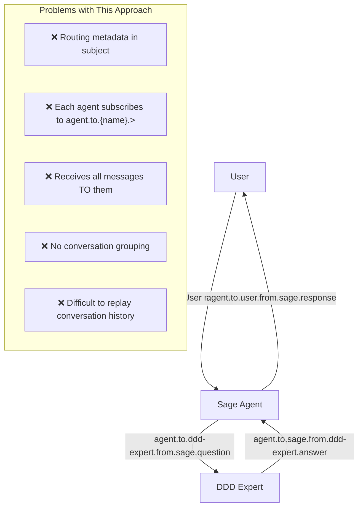
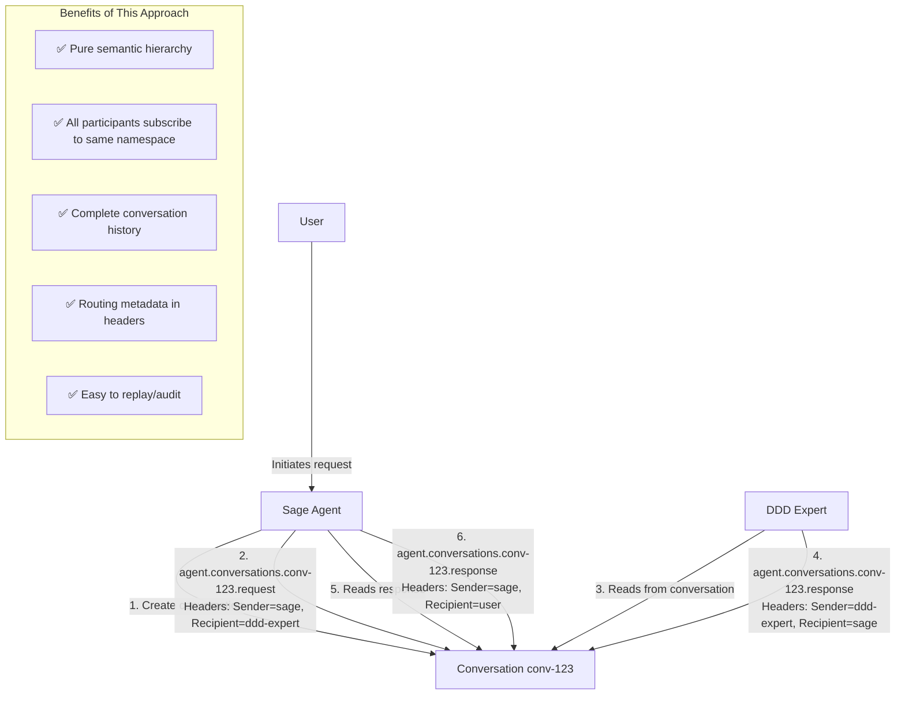
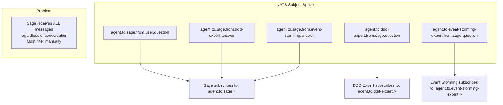
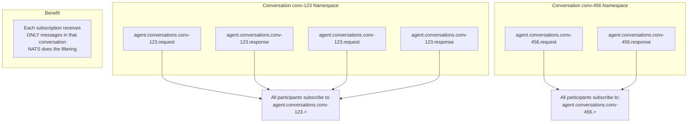

<!-- Copyright (c) 2025 - Cowboy AI, LLC. -->

# Subject Patterns: Visual Comparison

## Current Pattern (Incorrect)

### Subject Structure
```
agent.to.{recipient}.from.{sender}.{type}
       ↑               ↑               ↑
    routing       routing          semantic
    metadata      metadata          content
```

### Example Flow: Sage → DDD Expert



### Subscription Pattern
```
Sage subscribes to:        agent.to.sage.>
DDD Expert subscribes to:  agent.to.ddd-expert.>
```

**Problem**: Each agent must subscribe to a pattern that includes ALL messages addressed to them, even from different conversations. No natural conversation boundary.

---

## Proposed Pattern (Correct)

### Subject Structure
```
agent.conversations.{conversation_id}.{message_type}
      ↑                    ↑                  ↑
   category           namespace          semantic
                      boundary           content
```

### Example Flow: Sage → DDD Expert



### Subscription Pattern
```
All participants subscribe to:  agent.conversations.conv-123.>
```

**Benefit**: Single namespace for entire conversation. All participants see all messages via one subscription. Routing handled by headers.

---

## Pattern Matching Comparison

### Current Pattern: Inefficient Filtering

```rust
// Agent subscribes to ALL messages TO them
let pattern = "agent.to.sage.>";
let mut subscriber = nats.subscribe(pattern).await?;

while let Some(msg) = subscriber.next().await {
    // Receives:
    // - agent.to.sage.from.ddd-expert.question     (conv 1)
    // - agent.to.sage.from.user.question           (conv 2)
    // - agent.to.sage.from.event-storming.question (conv 3)
    // - agent.to.sage.from.nix-expert.question     (conv 4)

    // Must manually track which message belongs to which conversation!
    // No NATS-level conversation isolation
}
```

**Problem**: NATS delivers ALL messages to agent, regardless of conversation. Application must track conversation context manually.

### Proposed Pattern: Efficient Namespace Isolation

```rust
// All participants subscribe to CONVERSATION namespace
let pattern = format!("agent.conversations.{}.>", conv_id);
let mut subscriber = nats.subscribe(&pattern).await?;

while let Some(msg) = subscriber.next().await {
    // Receives ONLY messages in THIS conversation:
    // - agent.conversations.conv-123.request
    // - agent.conversations.conv-123.response
    // - agent.conversations.conv-123.error

    // NATS handles conversation isolation via subject hierarchy
    // Check headers to determine if message is for this agent
    if let Some(recipient) = msg.headers.get("Recipient") {
        if recipient == "sage" {
            // Process message
        }
    }
}
```

**Benefit**: NATS subject hierarchy provides O(1) conversation isolation. Application only receives messages from the conversation it cares about.

---

## Mathematical Properties

### Monoid Structure

#### Current Pattern: Non-Compositional
```
agent.to.{recipient}.from.{sender}.{type}
```

**Problem**: Cannot cleanly decompose into semantic components:
- `to.{recipient}` is routing, not semantic
- `from.{sender}` is routing, not semantic
- Only `{type}` represents domain semantics

**Violates Principle**: Subjects should represent **semantic hierarchies**, not routing metadata.

#### Proposed Pattern: Pure Monoid Composition
```
agent.conversations.{conv_id}.{type}
```

**Benefit**: Each segment represents semantic domain concept:
- `agent` = domain
- `conversations` = aggregate type
- `{conv_id}` = specific conversation instance
- `{type}` = message type within conversation

**Follows Principle**: Free monoid over validated semantic segments.

### Associativity Verification

```rust
// Domain composition is associative
let domain = Subject::parse("agent")?;
let category = Subject::parse("conversations")?;
let conv = Subject::parse("conv-123")?;
let msg_type = Subject::parse("request")?;

let left = domain.concat(&category).concat(&conv).concat(&msg_type);
let right = domain.concat(&category.concat(&conv).concat(&msg_type));

assert_eq!(left, right); // ✅ Associativity holds
assert_eq!(left.to_string(), "agent.conversations.conv-123.request");
```

---

## Routing Metadata: Subject vs Headers

### Current Pattern: Routing in Subject (Incorrect)

```rust
// Routing metadata embedded in subject
let subject = format!(
    "agent.to.{}.from.{}.{}",
    recipient, sender, message_type
);

// Problem: Routing and semantics mixed together
nats.publish(subject, payload).await?;
```

**Issues**:
1. ❌ Violates separation of concerns
2. ❌ Subject becomes longer and more complex
3. ❌ Routing changes require subject changes
4. ❌ Cannot change routing without changing subscription patterns

### Proposed Pattern: Routing in Headers (Correct)

```rust
// Semantic subject only
let subject = format!(
    "agent.conversations.{}.request",
    conv_id
);

// Routing metadata in headers (where it belongs)
let headers = async_nats::HeaderMap::from_iter([
    ("Sender", sender),
    ("Recipient", recipient),
    ("Conversation-Id", conv_id.to_string()),
    ("Correlation-Id", correlation_id.to_string()),
    ("Timestamp", timestamp.to_rfc3339()),
]);

nats.publish_with_headers(subject, headers, payload).await?;
```

**Benefits**:
1. ✅ Clean separation: subject = semantics, headers = routing
2. ✅ Subject remains simple and hierarchical
3. ✅ Routing can change independently of subscriptions
4. ✅ Follows NATS best practices

---

## Conversation History

### Current Pattern: Scattered Across Subjects

```
agent.to.sage.from.user.question
agent.to.ddd-expert.from.sage.question
agent.to.sage.from.ddd-expert.answer
agent.to.event-storming-expert.from.sage.question
agent.to.sage.from.event-storming-expert.answer
agent.to.user.from.sage.response
```

**Problem**: No single subject pattern matches entire conversation. Must track:
- Multiple subjects
- Multiple patterns
- Conversation state manually

**Query**: "Show me all messages in this conversation"
```rust
// No simple answer! Must:
// 1. Track all subjects used in conversation
// 2. Query each subject individually
// 3. Reconstruct conversation order manually
// 4. Filter out unrelated messages
```

### Proposed Pattern: Single Namespace Per Conversation

```
agent.conversations.conv-123.request   (Sage → DDD Expert)
agent.conversations.conv-123.response  (DDD Expert → Sage)
agent.conversations.conv-123.request   (Sage → Event Storming Expert)
agent.conversations.conv-123.response  (Event Storming Expert → Sage)
agent.conversations.conv-123.response  (Sage → User)
```

**Benefit**: Single namespace contains complete conversation.

**Query**: "Show me all messages in this conversation"
```rust
// Simple answer:
let pattern = format!("agent.conversations.{}.>", conv_id);
let messages = nats.fetch_all(pattern).await?;
// Done! All messages in conversation, in order.
```

---

## Subscription Efficiency

### Current Pattern: High Fan-Out



**Cost**: Each agent subscription matches ALL messages TO that agent across ALL conversations.

### Proposed Pattern: Namespace Isolation



**Benefit**: NATS subject hierarchy provides O(1) conversation isolation. Each subscription only receives messages from its conversation namespace.

---

## Summary Table

| Aspect | Current Pattern | Proposed Pattern |
|--------|----------------|------------------|
| **Subject Structure** | `agent.to.{recipient}.from.{sender}.{type}` | `agent.conversations.{conv_id}.{type}` |
| **Routing Metadata** | ❌ In subject | ✅ In headers |
| **Semantic Purity** | ❌ Mixed routing + semantics | ✅ Pure semantic hierarchy |
| **Conversation Grouping** | ❌ No natural grouping | ✅ Single namespace per conversation |
| **Pattern Matching** | ❌ Must filter manually | ✅ NATS does filtering (O(1)) |
| **History Queries** | ❌ Complex multi-subject query | ✅ Single pattern query |
| **Subscription Efficiency** | ❌ High fan-out (all messages to agent) | ✅ Namespace isolation (conversation only) |
| **Monoid Properties** | ❌ Non-compositional | ✅ Free monoid composition |
| **Mathematical Correctness** | ❌ Violates subject algebra | ✅ Follows free monoid structure |

---

## Conclusion

**The proposed conversation-based pattern is mathematically correct, efficient, and follows NATS best practices.**

Key insights:
1. ✅ **Subjects are semantic namespaces**, not mailboxes
2. ✅ **Routing metadata belongs in headers**, not subjects
3. ✅ **Conversations are first-class namespaces**, enabling natural grouping
4. ✅ **Pattern matching provides O(1) filtering**, eliminating manual application-level filtering
5. ✅ **Free monoid structure enables clean composition**, maintaining mathematical properties

**Result**: A subject hierarchy that is both mathematically sound and practically efficient for agent-to-agent conversations in NATS-based systems.
