# Agent Reference Theory - Visual Diagrams

## Frege's Sense and Reference Applied to Agents

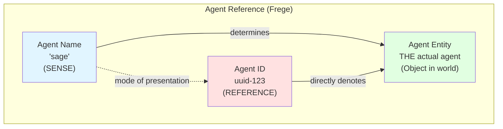

**Key Insight:** Names and IDs both point to the same entity, but via different routes:
- **Name** (sense) = HOW we conceive the agent ("the orchestrator")
- **ID** (reference) = THE agent itself (direct designation)

## Russell's Definite Description Analysis

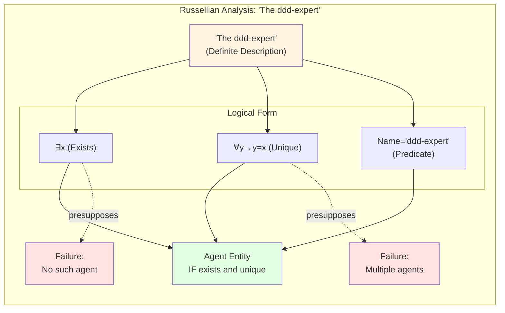

**Key Insight:** Names are DESCRIPTIONS that can fail if presuppositions violated. IDs are NAMES that cannot fail (once assigned).

## Evans' Causal Provenance Chain

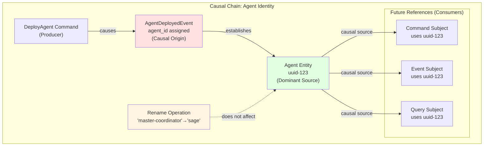

**Key Insight:** Agent ID traces back to creation event (causal origin). Renames don't affect causal chain.

## Searle's Cluster Theory: Capability Clusters

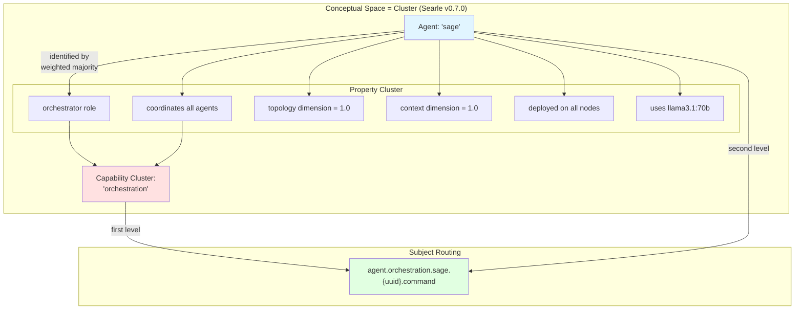

**Key Insight:** Agents identified by CLUSTERS of properties (conceptual spaces). Capability clusters enable routing.

## Complete Subject Hierarchy

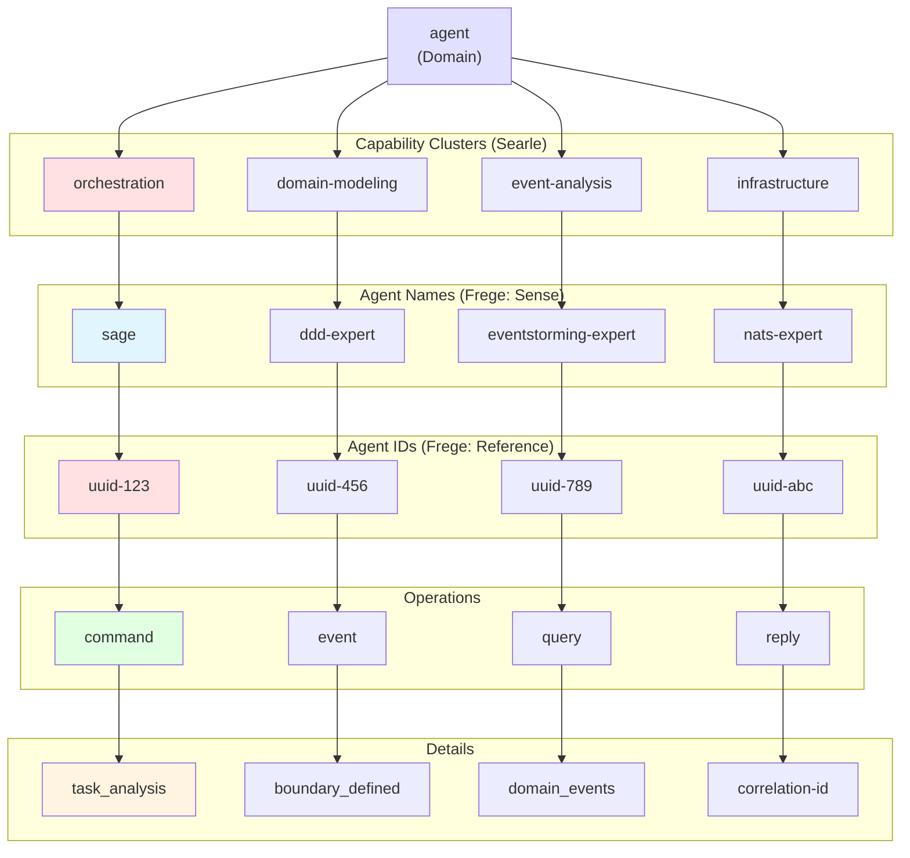

## Subscription Pattern Matching

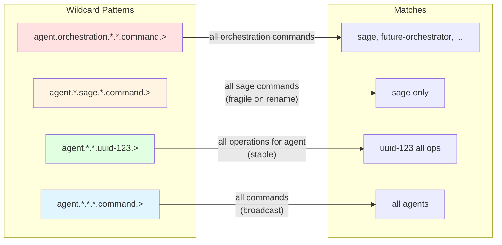

## Old vs New Pattern Comparison

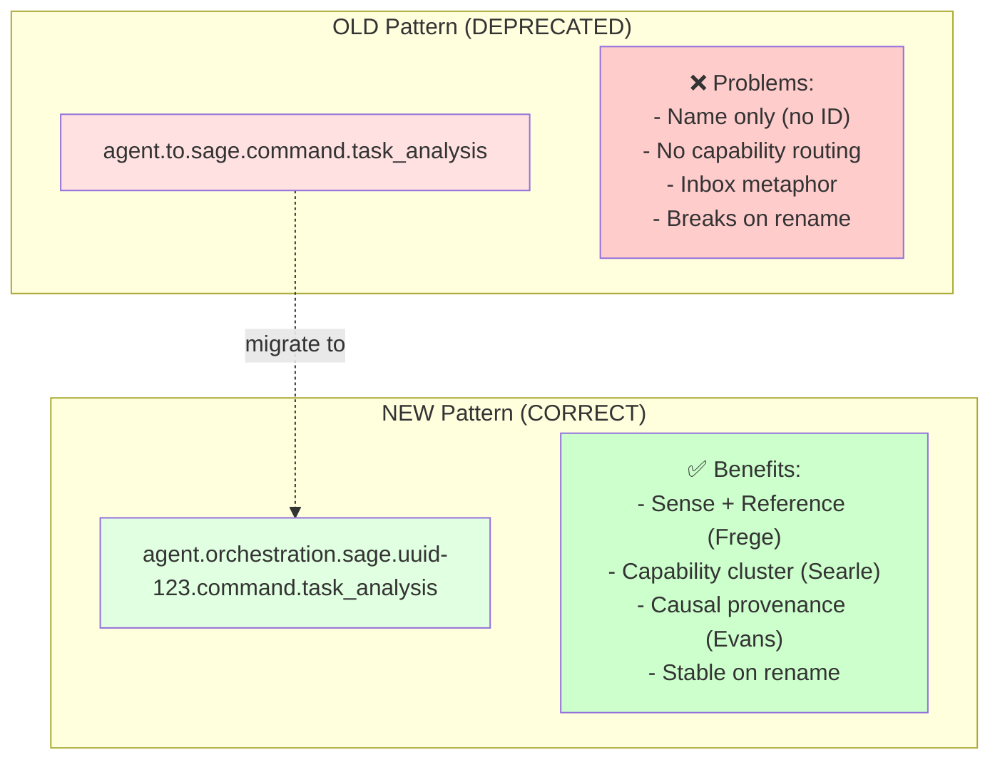

## Reference Theory Validation Matrix

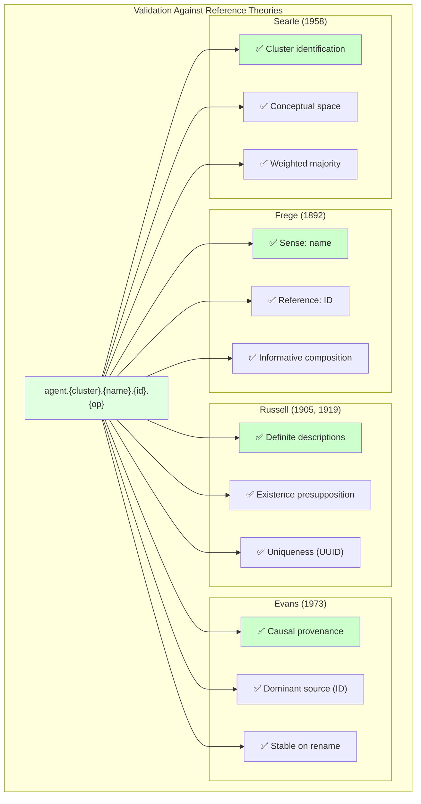

## Migration Timeline

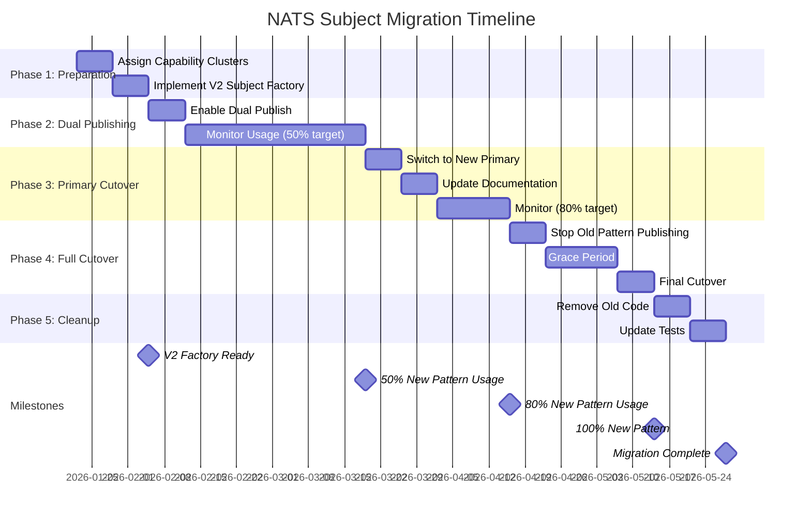

## The Morning Star Problem for Agents

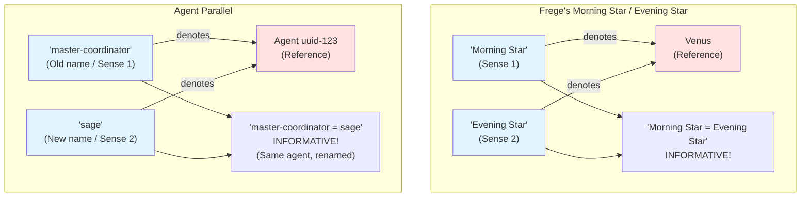

**Key Insight:** Just as "Morning Star = Evening Star" is informative (same planet, different observation times), "master-coordinator = sage" is informative (same agent, different role descriptions).

## Conceptual Space Membership

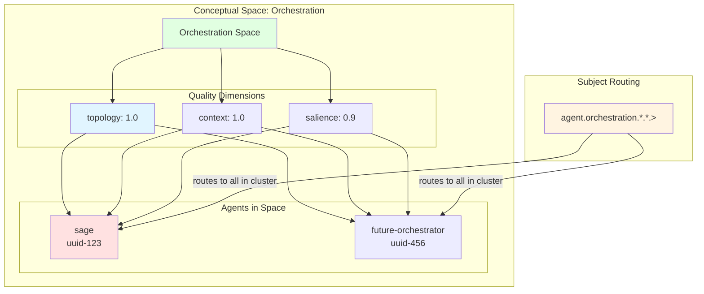

**Key Insight:** Conceptual space = cluster of quality dimensions (Searle v0.7.0). Agents in same space share capability cluster.

---

## Summary Diagram: The Complete Picture

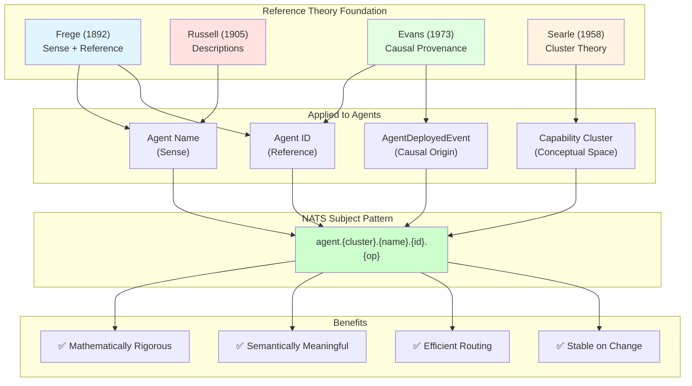

---

**These diagrams illustrate how 130+ years of reference theory (Frege 1892 → Searle 1958 → Evans 1973) provides the foundation for the correct way to reference agents in distributed systems.**

The subject pattern `agent.{cluster}.{name}.{id}.{operation}` is not arbitrary - it is the **natural consequence** of applying rigorous reference theory to the practical problem of agent communication.
