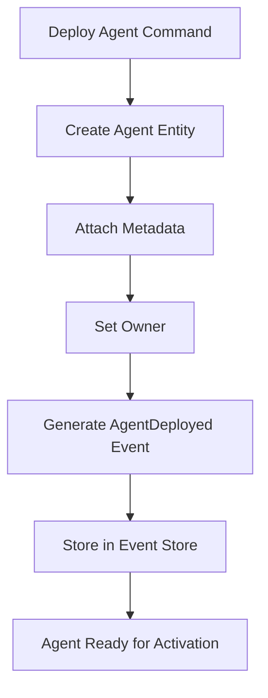
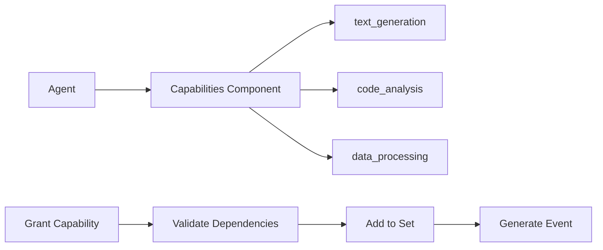
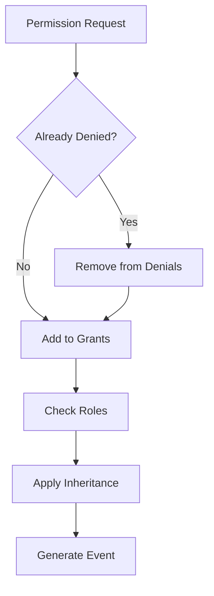
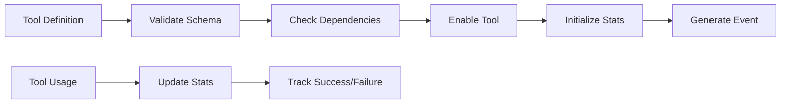
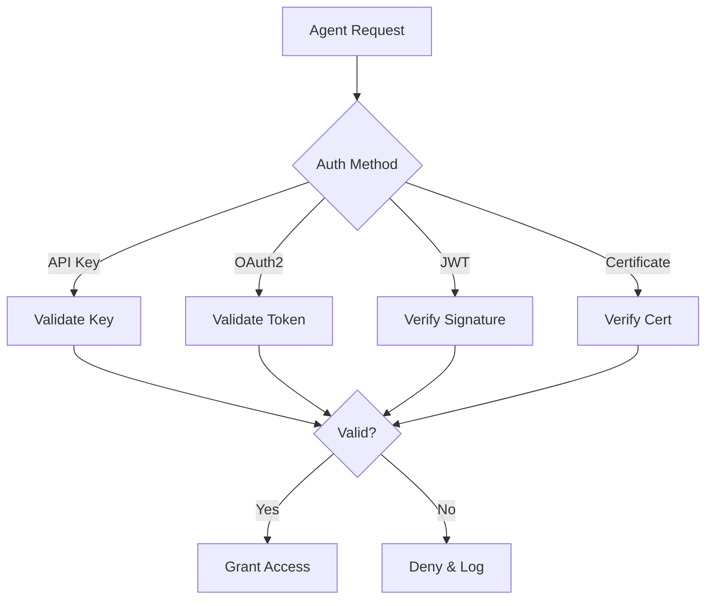
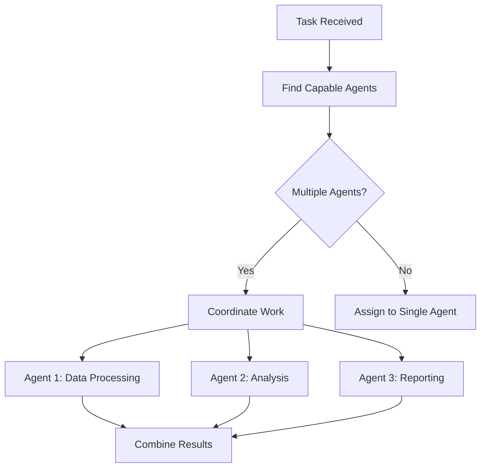

# User Stories for Agent Domain

## Overview

User stories for the Agent domain module, which manages autonomous entities that can perform actions on behalf of users or organizations in the CIM system.

## Agent Lifecycle Management

### Story A1: Deploy New Agent
**As a** system administrator  
**I want** to deploy a new agent with specific capabilities  
**So that** it can perform automated tasks on behalf of users

**Acceptance Criteria:**
- Agent created with unique ID and type (Human, AI, System, External)
- Owner relationship established (person or organization)
- Initial metadata attached (name, description, tags)
- AgentDeployed event generated with CID chain
- Agent starts in Initializing status

**Mermaid Diagram:**

**Tests:** `test_deploy_agent_command`, `test_agent_deployed_event`

### Story A2: Activate Agent
**As an** agent owner  
**I want** to activate my agent  
**So that** it can start performing tasks

**Acceptance Criteria:**
- Agent transitions from Initializing/Suspended/Offline to Active
- AgentActivated event generated
- Last active timestamp updated
- Cannot activate already active agent
- Cannot activate decommissioned agent

**Tests:** `test_activate_agent_command`, `test_agent_status_transitions`

### Story A3: Suspend Agent
**As an** agent owner  
**I want** to temporarily suspend my agent  
**So that** it stops performing actions while preserving its configuration

**Acceptance Criteria:**
- Agent transitions from Active to Suspended
- Suspension reason recorded
- AgentSuspended event generated
- Agent stops processing new tasks
- Configuration and permissions preserved

**Tests:** `test_suspend_agent_command`, `test_suspension_reason_tracking`

### Story A4: Decommission Agent
**As a** system administrator  
**I want** to permanently decommission an agent  
**So that** it cannot be reactivated and resources are freed

**Acceptance Criteria:**
- Agent transitions to Decommissioned status
- AgentDecommissioned event generated
- Cannot be reactivated
- Audit trail preserved
- Resources marked for cleanup

**Tests:** `test_decommission_agent_command`, `test_decommission_is_permanent`

## Capability Management

### Story A5: Grant Agent Capabilities
**As an** agent administrator  
**I want** to grant specific capabilities to an agent  
**So that** it can perform new types of tasks

**Acceptance Criteria:**
- Capabilities added to agent's capability set
- AgentCapabilitiesAdded event generated
- Capability metadata stored (version, description)
- Duplicate capabilities handled gracefully
- Capability dependencies validated

**Mermaid Diagram:**

**Tests:** `test_grant_capabilities_command`, `test_capability_dependencies`

### Story A6: Revoke Agent Capabilities
**As an** agent administrator  
**I want** to remove capabilities from an agent  
**So that** it no longer performs certain types of tasks

**Acceptance Criteria:**
- Capabilities removed from agent's set
- AgentCapabilitiesRemoved event generated
- Active tasks using capability handled gracefully
- Dependent capabilities cascade removed
- Audit trail maintained

**Tests:** `test_revoke_capabilities_command`, `test_capability_cascade_removal`

## Permission Management

### Story A7: Grant Agent Permissions
**As a** security administrator  
**I want** to grant specific permissions to an agent  
**So that** it can access required resources

**Acceptance Criteria:**
- Permissions added to granted set
- Removed from denied set if present
- AgentPermissionsGranted event generated
- Role-based permissions expanded
- Permission inheritance applied

**Mermaid Diagram:**

**Tests:** `test_grant_permissions_command`, `test_permission_inheritance`

### Story A8: Revoke Agent Permissions
**As a** security administrator  
**I want** to explicitly deny permissions to an agent  
**So that** it cannot access sensitive resources

**Acceptance Criteria:**
- Permissions added to denied set
- Removed from granted set
- AgentPermissionsRevoked event generated
- Explicit denials override role grants
- Cascading effects documented

**Tests:** `test_revoke_permissions_command`, `test_explicit_denial_override`

## Tool Management

### Story A9: Enable Agent Tools
**As a** developer  
**I want** to enable specific tools for an agent  
**So that** it can interact with external systems

**Acceptance Criteria:**
- Tools added with full definitions (name, version, parameters)
- AgentToolsEnabled event generated
- Tool parameter schemas validated
- Usage statistics initialized
- Tool dependencies checked

**Mermaid Diagram:**

**Tests:** `test_enable_tools_command`, `test_tool_schema_validation`

### Story A10: Disable Agent Tools
**As a** developer  
**I want** to disable tools for an agent  
**So that** it stops using deprecated or problematic integrations

**Acceptance Criteria:**
- Tools marked as disabled
- AgentToolsDisabled event generated
- Active tool invocations handled gracefully
- Usage statistics preserved
- Cleanup procedures initiated

**Tests:** `test_disable_tools_command`, `test_active_tool_handling`

### Story A11: Track Tool Usage
**As a** system analyst  
**I want** to track how agents use tools  
**So that** I can optimize performance and identify issues

**Acceptance Criteria:**
- Invocation count tracked per tool
- Success/failure rates recorded
- Last usage timestamp updated
- Performance metrics collected
- Usage patterns analyzable

**Tests:** `test_tool_usage_tracking`, `test_usage_statistics_accuracy`

## Configuration Management

### Story A12: Set Agent Configuration
**As an** agent administrator  
**I want** to configure agent-specific settings  
**So that** behavior can be customized

**Acceptance Criteria:**
- Configuration key-value pairs stored
- AgentConfigurationSet event generated
- Configuration versioning supported
- Type validation for known keys
- Hot-reload capability for certain settings

**Tests:** `test_set_configuration_command`, `test_configuration_versioning`

### Story A13: Remove Agent Configuration
**As an** agent administrator  
**I want** to remove configuration settings  
**So that** defaults are restored

**Acceptance Criteria:**
- Configuration keys removed
- AgentConfigurationRemoved event generated
- Defaults applied automatically
- Dependent configurations handled
- Rollback capability preserved

**Tests:** `test_remove_configuration_command`, `test_default_restoration`

## Authentication & Security

### Story A14: Authenticate Agent
**As a** security system  
**I want** to authenticate agents before allowing actions  
**So that** only authorized agents can operate

**Acceptance Criteria:**
- Multiple auth methods supported (API Key, OAuth2, JWT, Certificate)
- Authentication events generated
- Failed attempts tracked
- Token refresh handled
- Session management implemented

**Mermaid Diagram:**

**Tests:** `test_agent_authentication`, `test_auth_method_support`

### Story A15: Audit Agent Actions
**As a** compliance officer  
**I want** to audit all agent actions  
**So that** I can ensure regulatory compliance

**Acceptance Criteria:**
- All agent actions logged with timestamps
- Actor (agent) clearly identified
- Action context preserved
- Audit trail immutable
- Query capabilities for audit reports

**Tests:** `test_agent_action_audit`, `test_audit_immutability`

## Agent Queries

### Story A16: Find Agents by Owner
**As a** user  
**I want** to see all agents I own  
**So that** I can manage them effectively

**Acceptance Criteria:**
- Query returns all agents for given owner ID
- Includes agents owned by user's organizations
- Results include status and capabilities
- Pagination supported
- Real-time updates via projections

**Tests:** `test_find_agents_by_owner`, `test_organization_ownership`

### Story A17: Find Agents by Capability
**As a** system coordinator  
**I want** to find agents with specific capabilities  
**So that** I can assign appropriate tasks

**Acceptance Criteria:**
- Query by single or multiple capabilities
- AND/OR logic supported
- Results ranked by capability match
- Performance optimized for large sets
- Capability versions considered

**Tests:** `test_find_agents_by_capability`, `test_capability_search_performance`

### Story A18: Get Agent Status Summary
**As a** system monitor  
**I want** to see agent status distribution  
**So that** I can ensure system health

**Acceptance Criteria:**
- Count agents by status
- Show status transitions over time
- Identify stuck or problematic agents
- Real-time dashboard updates
- Alert thresholds configurable

**Tests:** `test_agent_status_summary`, `test_status_monitoring`

## Integration Scenarios

### Story A19: Agent Collaboration
**As a** workflow designer  
**I want** agents to collaborate on tasks  
**So that** complex workflows can be automated

**Acceptance Criteria:**
- Agents can discover each other by capability
- Message passing between agents supported
- Coordination patterns implemented
- Failure handling for agent unavailability
- Performance metrics for collaboration

**Mermaid Diagram:**

**Tests:** `test_agent_collaboration`, `test_coordination_patterns`

### Story A20: Agent Monitoring
**As an** operations engineer  
**I want** to monitor agent health and performance  
**So that** I can maintain system reliability

**Acceptance Criteria:**
- Health checks for each agent type
- Performance metrics collected
- Anomaly detection implemented
- Automatic recovery attempted
- Alerts for critical issues

**Tests:** `test_agent_health_monitoring`, `test_anomaly_detection`

## Legend

- ✅ Core functionality defined
- 🔄 Integration points identified
- 📊 Monitoring capabilities specified
- 🔐 Security requirements included

## Test Coverage Requirements

- Unit tests for all aggregate methods
- Integration tests for command/event flow
- Performance tests for agent discovery
- Security tests for authentication
- Load tests for concurrent agents 