<!-- Copyright (c) 2025 - Cowboy AI, Inc. -->

# Configuration Parser Architecture

## High-Level Pipeline


## Module Dependencies


## Type Hierarchy


## Function Composition Flow


## Error Handling Flow


## Data Flow: Builder Pattern

```mermaid
graph LR
    A[AgentMetadata::new] -->|owns| B[AgentMetadata v1]
    B -->|consumes| C[with_display_name]
    C -->|produces| D[AgentMetadata v2]
    D -->|cannot use v1| E[✓ Type Safe]

    style A fill:#e1f5ff
    style B fill:#fff4e1
    style C fill:#f3e5f5
    style D fill:#e8f5e9
    style E fill:#c8e6c9
```



## Iterator Chain: Section Extraction


## Monadic Composition


## Validation Pipeline


## Performance: Zero-Cost Abstractions


## Ownership Transfer

```mermaid
graph LR
    A[metadata: AgentMetadata] -->|move| B[with_display_name]
    B -->|return| C[new_metadata: AgentMetadata]

    A -.cannot use.-> D[✗ Compile Error]
    C -.can use.-> E[✓ Type Safe]

    style A fill:#e1f5ff
    style B fill:#f3e5f5
    style C fill:#e8f5e9
    style D fill:#ffebee
    style E fill:#c8e6c9
```



## Complexity Analysis


## Property Testing: Functor Laws

```mermaid
graph TD
    A[Functor Laws] --> B[Identity: fmap id = id]
    A --> C[Composition: fmap~g ∘ f~ = fmap g ∘ fmap f]

    B --> D[result.map~|x| x~ == result]
    C --> E[result.map~|x| g~f~x~~~ == result.map~f~.map~g~]

    D --> F[✓ Property Verified]
    E --> F

    style A fill:#e1f5ff
    style F fill:#e8f5e9
```

## Property Testing: Monad Laws

```mermaid
graph TD
    A[Monad Laws] --> B[Left Identity]
    A --> C[Right Identity]
    A --> D[Associativity]

    B --> E[Ok~a~.and_then~f~ == f~a~]
    C --> F[m.and_then~Ok~ == m]
    D --> G[m.and_then~f~.and_then~g~ == m.and_then~|x| f~x~.and_then~g~~]

    E --> H[✓ Verified]
    F --> H
    G --> H

    style A fill:#e1f5ff
    style H fill:#e8f5e9
```

---

## Legend

| Color | Meaning |
|-------|---------|
| 🔵 Blue | Input/Source |
| 🟡 Yellow | Transformation |
| 🟣 Purple | Processing |
| 🟢 Green | Output/Success |
| 🔴 Red | Error/Failure |

## Key Insights

1. **Pure Functions**: Every box is deterministic (same input → same output)
2. **Composition**: Arrows show function composition (f ∘ g)
3. **Type Safety**: Colored boxes show type transformations
4. **Zero-Cost**: High-level and low-level paths produce identical machine code
5. **Ownership**: Dotted lines show moved values cannot be reused

---

**Generated**: 2026-01-22
**Version**: 1.0.0
